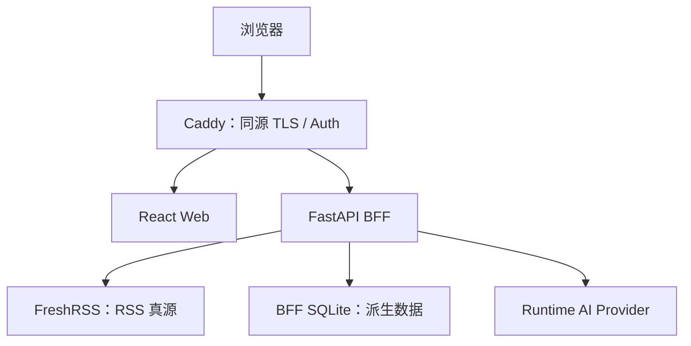

# LumiRSS 自托管 AI RSS Reader 产品需求文档

> 文档版本：v3.3  
> 计划日期：2026-08-06  
> 资料核验截止：2026-08-05  
> 状态：Implementation Ready  
> 产品名：LumiRSS  
> 仓库名 / 项目代号：`LumiRSS`  
> 初始开发环境：Qoder CN Desktop  
> 初始开发模型入口：Qoder CN Pro+  
> 产品形态：单用户、自托管、AI 增强型 RSS 阅读系统

---

## 0. 文档目的与 v3.3 修订结论

本文档是 LumiRSS Phase 0—4 的产品与工程实施合同。它定义范围、数据责任、接口语义、安全边界、验收条件和阶段依赖；实现细节可通过 ADR 调整，但不得无记录地改变这些边界。

v3.3 在 v3.2 正确架构方向上完成了以下关键收口：

1. **统一命名**：产品名、仓库名和技术项目代号统一为 `LumiRSS`；仅代码包名等受语言规范约束的标识使用小写 `lumirss`。
2. **控制面与数据面分离**：FreshRSS Google Reader API 是正式数据通路；OPML 导入/导出和立即刷新在 MVP 中使用 FreshRSS 原生控制面，不假设存在未验证的公共 API。
3. **远程认证不再“多选一”**：本地部署仅绑定 loopback；远程默认采用 Caddy HTTPS + `basic_auth`。Tailscale 是可替代部署方式，不是并行必装组件。
4. **不把原始上游 ID 直接放入 URL**：API 对外使用 URL-safe 的 `entryRef`、`feedRef`，前端仍必须把它们视为不透明字符串。
5. **游标有完整语义**：游标签名、过期时间、查询指纹和错误码均明确；分页正确性在冻结数据集上验收。
6. **状态写入改为幂等接口**：已读/收藏使用 `PUT`，批量操作有数量上限，失败时前端回滚乐观更新。
7. **补齐正文缓存边界**：BFF 可以保存可丢弃、带 TTL 的“派生正文缓存”，但它不是 RSS 真源，也不能反向覆盖 FreshRSS。
8. **AI 请求不引入队列**：MVP 使用同步、限并发调用；结果和失败状态持久化，不使用 Redis、RQ 或 Celery。
9. **首个生产 Runtime Provider 收口为 OpenAI-compatible HTTP Adapter**：测试仍使用 Fake Provider；Qoder Credits 与产品 Runtime AI 完全分账。
10. **加入内容安全闭环**：正文抓取防 SSRF，RSS HTML 必须清洗，默认阻止远程图片自动加载，云端 AI 明示数据外发。
11. **修正许可证事实**：Trafilatura 当前版本使用 Apache-2.0；v1.8.0 之前版本使用 GPLv3+，依赖锁定时仍需生成第三方许可证清单。
12. **Qoder 规则分层更准确**：根 `AGENTS.md` 是共享基线；Desktop 使用 `.lingma/rules/`，CLI 使用 `.qoder/rules/`。规则不是安全边界，敏感操作还要靠权限、Hook 和 CI。
13. **移除未经证实的路线图断言**：Folo 兼容结论只基于固定版本的可复现实验，不以“官方未来会或不会支持”作为架构依据。
14. **补齐非功能指标、恢复目标和 Golden Tasks**：Implementation Ready 不再只表示“目录已列出”，而表示关键行为可以被测试。

---

## 1. 产品定义

LumiRSS 是面向个人开发者和重度信息消费者的自托管 RSS 阅读系统。

它组合：

- FreshRSS 的订阅、抓取、状态同步和原生控制面；
- 项目自有的 FastAPI BFF 与稳定 API Contract；
- 简洁、可键盘操作的三栏 Web 阅读界面；
- 用户主动触发的 AI 摘要和翻译；
- 可迁移、可备份、可恢复的数据与部署结构。

LumiRSS 不以复刻 Folo 的全部能力为目标，也不以兼容 Folo 私有服务端协议作为产品成立的前提。

### 1.1 核心价值

1. **数据自主**：订阅、文章状态、AI 结果和部署配置由用户控制。
2. **降低噪声**：按需摘要和翻译降低理解成本；自动推荐、去重和日报不进入 MVP。
3. **避免平台锁定**：订阅可通过标准 OPML 迁移，RSS 状态保存在 FreshRSS，项目 API 不绑定 Folo 私有协议。
4. **轻量运行**：普通 VPS、本地 Docker 或通过 SSH/Tailscale 访问的个人服务器均可运行。
5. **长期可维护**：领域模型、适配器、Contract、ADR、测试和恢复演练是核心资产。
6. **开发工具可替换**：Qoder CN 是初始 Harness，不是项目运行时依赖或唯一维护入口。

### 1.2 产品假设

- 只有一个受信任用户，不提供公众注册。
- 用户理解基本 Docker、域名和备份操作。
- FreshRSS 是唯一 RSS 数据真源。
- 首屏与核心阅读不能依赖 Runtime AI 可用。
- 一个 BFF 实例、一个 Uvicorn worker 足以满足 MVP；水平扩容不在目标内。

### 1.3 北极星任务

用户能在不打开 FreshRSS 原生阅读界面的情况下，完成以下闭环：

> 选择订阅或未读视图 → 浏览文章列表 → 阅读正文 → 同步已读/收藏状态 → 需要时生成中文摘要或翻译 → 下次打开仍保持一致。

---

## 2. 目标、非目标与成功定义

### 2.1 MVP 目标

#### RSS 阅读

- 查看全部、未读、收藏文章；
- 按 Feed 和分类筛选；
- 查看文章详情；
- 标记已读、未读、收藏、取消收藏；
- 使用游标分页；
- 在浏览器保存最近阅读位置和界面偏好；
- 在状态写入失败时明确回滚并提示。

#### 订阅管理

- 查看 Feed 与分类；
- 添加 Feed；
- 删除 Feed；
- 显示最近抓取状态或上游错误摘要；
- 通过 FreshRSS 原生控制面完成 OPML 导入/导出和立即刷新。

> 说明：MVP 不在 BFF 中重新实现 FreshRSS 尚未形成稳定公共契约的 OPML 导入和立即刷新流程。生产 FreshRSS 默认不暴露公网；控制面通过 loopback、SSH 隧道或私网访问。Phase 0 必须提供对应 Runbook 和入口说明。

#### AI

- 用户主动触发单篇摘要；
- 用户主动触发标题、正文或两者的翻译；
- 缓存相同输入和版本的结果；
- 展示 Provider、模型、Prompt 版本、生成时间、使用量和失败状态；
- Runtime AI 关闭或失败时，RSS 阅读完全可用。

#### 工程与运维

- Docker Compose 一键启动；
- `/health/live` 和 `/health/ready`；
- OpenAPI Contract；
- 数据库迁移；
- 单元、Contract、集成和关键 E2E 测试；
- GitHub Actions；
- 日志脱敏；
- 可校验备份、恢复脚本和一次真实恢复演练。

### 2.2 MVP 明确不实现

- Folo 完整后端兼容；
- Miniflux 或多 RSS 后端；
- 多用户、注册、组织权限、OAuth；
- Social、Lists、Collections、Inbox、支付或 Wallet；
- 推荐算法、自动日报、AI Chat；
- 自动去重、语义搜索、向量数据库；
- 多模型自动路由或自动回退；
- Redis、RQ、Celery、n8n；
- 原生移动 App、Capacitor；
- 离线优先或完整 PWA；
- 图片代理；
- 无人值守生产部署；
- 并行写入同一工作区的多 Agent 开发流程。

### 2.3 MVP 成功指标

| 指标 | 目标 | 验证方式 |
|---|---:|---|
| Clean clone 可启动 | ≤ 30 分钟人工操作 | 在空白环境执行 Runbook；镜像/依赖下载等待单列 |
| FreshRSS Adapter Contract | 全部通过 | 固定 FreshRSS 镜像 + 测试用户 |
| 冻结数据集两页重复率 | 0 | 分页集成测试 |
| 冻结数据集两页遗漏 | 0 | 与已知 fixture ID 集合对比 |
| 已读/收藏状态已知同步错误 | 0 | BFF 与 FreshRSS 原生 UI 对照 |
| AI 关闭后核心阅读可用 | 100% Golden Tasks | E2E 测试 |
| 同一缓存键重复收费调用 | 0 | Fake Provider 调用计数 |
| XSS/SSRF 安全 fixture 通过率 | 100% | 安全回归测试 |
| 仓库 Secret 泄漏 | 0 | CI Secret Scan + 人工检查 |
| 主干失败构建 | 0 个未处置失败 | GitHub Actions |
| 恢复点目标 RPO | ≤ 24 小时 | 备份计划与演练 |
| 恢复时间目标 RTO | ≤ 60 分钟 | 全新机器恢复演练 |
| Qoder/其他工具切换恢复 | ≤ 3 分钟 | 读取 AGENTS + STATE 的演练 |

“0 个已知错误”不是零缺陷承诺；发现后必须建 Issue、标级并记录临时缓解。

---

## 3. 用户与核心场景

### 3.1 第一目标用户

项目所有者本人：

- 单用户；
- 已经使用 RSS；
- 关注 AI 和技术信息；
- 需要中文摘要和翻译；
- 希望数据自托管；
- 愿意维护 Docker 服务；
- 初期使用 Qoder CN Desktop + Pro+ 辅助开发。

### 3.2 暂不服务

- 企业多租户；
- 公众 SaaS；
- 社交内容平台；
- 大规模 Feed 托管；
- 商业推荐系统；
- 需要复杂组织权限的团队。

### 3.3 核心用户故事

| ID | 用户故事 | MVP 验收摘要 |
|---|---|---|
| US-01 | 我想查看未读文章 | 首屏可选“未读”，分页不重复 |
| US-02 | 我想按 Feed/分类筛选 | URL 可恢复筛选状态，空状态明确 |
| US-03 | 我想阅读并同步状态 | 打开或手动操作后 FreshRSS 状态一致 |
| US-04 | 我想收藏文章 | Web 与 FreshRSS 原生 UI 双向一致 |
| US-05 | 我想新增或删除订阅 | 成功后列表刷新；重复添加幂等处理 |
| US-06 | 我想迁移订阅 | 有 FreshRSS OPML 导入/导出 Runbook |
| US-07 | 我想快速理解长文 | 主动点击后生成中文摘要并缓存 |
| US-08 | 我想翻译内容 | 可选标题、正文或两者，目标语言明确 |
| US-09 | AI 不可用时继续阅读 | 不阻塞 Feed、Entry、状态接口 |
| US-10 | 我想恢复故障服务器 | 在新机器按 Runbook 于 60 分钟内恢复 |

---

## 4. 架构决策与系统边界

### 4.1 正式路径与实验路径

正式产品路径：



可选实验路径：

> 固定版本 Folo → Folo Compatibility Gateway → 项目 BFF

实验路径不得修改正式 API Contract 来迁就 Folo，也不得阻塞 Phase 0—4。

### 4.2 组件职责

| 组件 | 负责 | 不负责 |
|---|---|---|
| FreshRSS | Feed、分类、Entry、抓取、已读、收藏、OPML、原生控制面 | LumiRSS AI 结果、LumiRSS UI 设置 |
| FastAPI BFF | 领域 API、FreshRSS 映射、ID/游标编解码、内容清洗、AI 调用与缓存 | 复制完整 FreshRSS 数据库、定时抓取 Feed |
| BFF SQLite | AI Artifact、请求审计、派生正文缓存、服务端设置、Schema 版本 | Feed/Entry 权威状态、Secrets |
| React Web | 阅读 UI、客户端缓存、乐观更新、局部界面设置 | RSS 权威状态、Provider Secret |
| Caddy | TLS、同源路由、远程 Basic Auth、安全响应头 | 业务授权、内容解析 |
| Runtime AI | 摘要与翻译推理 | RSS 抓取、状态同步、开发期编码 |
| Qoder CN | 开发期规划、编码、测试、Review | 产品运行时推理、生产控制面 |

### 4.3 Folo 兼容不在关键路径

截至资料核验日，Folo 官方仓库明确提供客户端代码与 AGPL-3.0 许可，并允许通过环境变量配置 API URL；但没有在项目文档中识别到可作为本项目稳定依赖的、独立部署的完整服务端契约。该判断是对当前公开材料的工程推论，而不是对 Folo 未来路线图的断言。

因此 Folo 仅用于：

1. 信息层级与交互参考；
2. 固定版本兼容性实验；
3. 未来可能的可选客户端。

Folo 仓库含不可再分发的特定图标目录；LumiRSS 不复制其代码、图标或私有资产。涉及许可证的最终判断不是本 PRD 的法律意见，公开发布前需完成依赖与资产审查。

### 4.4 架构约束

- MVP 只实现 `FreshRSSAdapter`；可以定义 `FeedBackend` Protocol，但禁止提前实现第二后端。
- 生产 Compose 不使用 `latest` 标签；镜像必须固定到已测试版本，发布记录保存镜像 digest。
- BFF MVP 固定单进程、单 worker；若以后增加多 worker，必须先解决跨进程 AI 去重与锁。
- 浏览器和 BFF 只能通过项目 API 操作 RSS；FreshRSS 凭据绝不下发前端。
- OpenAPI 是前后端 Contract 真源；文档示例不能替代机器校验。

---

## 5. 数据责任与领域模型

### 5.1 数据真源

| 数据 | 权威位置 | 可缓存位置 | 恢复来源 |
|---|---|---|---|
| Feed / 分类 | FreshRSS | Web Query Cache | FreshRSS 备份 / OPML |
| Entry / 抓取内容 | FreshRSS | Web Query Cache | FreshRSS 备份 |
| 已读 / 收藏 | FreshRSS | Web 乐观状态 | FreshRSS 备份 |
| AI 摘要 / 翻译 | BFF SQLite | Web Query Cache | BFF SQLite 备份或重新生成 |
| 派生全文 | BFF SQLite 可丢弃缓存 | Web 当前会话 | 重新抓取与提取 |
| 服务端 UI 设置 | BFF SQLite | Web | BFF SQLite 备份 |
| 面板宽度 / 主题 / 字号 | 浏览器 localStorage | — | 用户重新设置 |
| 阅读滚动位置 | 浏览器 localStorage，LRU 上限 200 篇 | — | 可丢失 |
| Secrets | 主机 Secret 文件或部署环境 | 进程内存 | 单独加密备份 |

### 5.2 对外引用 ID

FreshRSS 的原始 ID 不保证是整数、UUID 或 URL-safe 字符串。LumiRSS 定义：

- `feedRef = "f1." + base64url(UTF-8 upstream_feed_id)`；
- `entryRef = "e1." + base64url(UTF-8 upstream_entry_id)`；
- `categoryRef = "c1." + base64url(UTF-8 upstream_category_id_or_name)`；
- 省略 Base64 padding；
- 编码文本必须是规范 Base64url；解码后 UTF-8 最多 4,096 bytes，非法前缀、非规范编码或超限返回 `400 invalid_reference`；
- Base64 是传输编码，不是加密或授权；
- 前端禁止解码、排序、拼接或推断其结构。

该设计避免 `%2F`、反向代理重复解码和路由器路径分段问题，同时保持 ID 可稳定复现。

### 5.3 Feed 模型

```json
{
  "feedRef": "f1.b3BhcXVl",
  "title": "Example Feed",
  "feedUrl": "https://example.com/feed.xml",
  "siteUrl": "https://example.com/",
  "category": {
    "categoryRef": "c1.dGVjaA",
    "name": "Tech"
  },
  "unreadCount": 12,
  "lastFetchedAt": "2026-08-05T10:00:00Z",
  "health": "ok"
}
```

约束：

- 时间统一输出 RFC 3339 UTC；未知字段为 `null`，不伪造当前时间。
- `health` 枚举为 `ok | stale | error | unknown`；它是展示信息，不作为 BFF readiness 的唯一依据。
- `category` 可以为 `null`。

### 5.4 Entry 列表与详情模型

列表项不返回完整正文：

```json
{
  "entryRef": "e1.dGFnOmdvb2dsZS5jb20sMjAwNTpyZWFkZXIvaXRlbS8wMDAx",
  "feedRef": "f1.NDI",
  "feedTitle": "Example Feed",
  "title": "Article title",
  "author": null,
  "url": "https://example.com/article",
  "publishedAt": "2026-08-05T09:00:00Z",
  "excerpt": "Plain-text excerpt…",
  "isRead": false,
  "isStarred": false,
  "ai": {
    "summaryStatus": "none",
    "translationStatus": "none"
  }
}
```

详情在此基础上增加：

- `contentHtml`：服务端已清洗的 HTML；
- `contentText`：供复制、AI 和无障碍降级使用的纯文本；
- `contentSource`：`freshrss | extracted | empty`；
- `updatedAt`；
- 当前匹配语言的 AI Artifact。

所有标题、作者和摘要字段输出纯文本；标题最大 1,000 字符、作者最大 500 字符、列表摘要最大 2,000 字符，超出时确定性截断并保留完整正文。`url` / `siteUrl` 只允许 `http` 或 `https`，非法值映射为 `null`。任何上游原始 HTML 都不得绕过清洗直接进入 Contract。

### 5.5 BFF SQLite 表

MVP 使用 SQLAlchemy 2.x、Alembic 和 `aiosqlite`。必须启用 WAL、`foreign_keys=ON` 和合理的 busy timeout。

#### `ai_artifacts`

- `id`；
- `operation`：`summary | translation`；
- `entry_ref`；
- `input_hash`；
- `input_pipeline_version`：正文来源/提取器与输入规范化算法版本；
- `provider`；
- `model`；
- `prompt_version`；
- `output_schema_version`；
- `target_language`：规范化后的 BCP 47 风格语言标签；
- `translation_scope`：`none | title | content | both`，摘要固定使用 `none`；
- `status`：`running | succeeded | failed`；
- `result_json`；
- `error_code`、`error_message_safe`；
- `input_tokens`、`output_tokens`；
- `estimated_cost`、`currency`、`pricing_version`；
- `started_at`、`finished_at`、`created_at`、`updated_at`。

唯一键至少覆盖：

> operation + entry_ref + input_hash + input_pipeline_version + provider + model + prompt_version + output_schema_version + target_language + translation_scope

唯一键中的字段全部 `NOT NULL`；不得用 SQLite 的可空 `NULL` 表示“不适用”，否则相同摘要可能绕过唯一约束。第一次生成可把 Artifact 标为 `running`；重生成时旧的成功结果继续可读，新 Attempt 成功后再原子替换当前结果，失败则保留旧结果并展示最近 Attempt 的失败状态。

#### `content_cache`

- `entry_ref`；
- `source_url`；
- `content_hash`；
- `extractor`、`extractor_version`；
- `content_text`；
- `sanitized_html`（可空）；
- `fetched_at`、`expires_at`；
- `byte_size`。

默认 TTL 为 7 天，总容量软上限 50 MiB，LRU 清理。删除缓存不能影响文章列表、状态或已生成 AI Artifact。

#### `ai_attempts`

每次实际调用 Provider 都写一条不可覆盖的尝试记录：`artifact_id`、`attempt_no`、`trigger`（首次/用户重生成）、`status`、安全错误码、usage、估算成本、开始/结束时间、requestId 和可空且唯一的 `idempotency_key`。不得保存 Prompt 或正文。`ai_artifacts` 表示当前可复用结果，`ai_attempts` 用于审计重复调用和成本；同一缓存键重生成可更新 Artifact，但不能删除历史 Attempt。

#### `idempotency_records`

所有 AI POST（包括缓存命中）记录 `idempotency_key`、规范化请求的 `request_hash`、可空的 `artifact_id` / `attempt_id`、处理状态、HTTP 状态、安全错误码、`created_at` 和 `expires_at`。不复制 Prompt、文章正文或完整响应；重放时从 Artifact/Attempt 重建响应。记录至少保留 24 小时，过期后清理。

#### `settings`

仅保存非 Secret 的服务端单用户设置，例如默认摘要语言、打开即标记已读。Provider API Key、FreshRSS API 密码和 Basic Auth 哈希不得进入该表。

---

## 6. API Contract

### 6.1 通用原则

- Base path：`/api/v1`；
- JSON 字段使用 `camelCase`；Python 内部可用 `snake_case`，由 Schema 映射；
- 所有时间使用 RFC 3339 UTC；
- 状态写接口必须幂等；可能产生外部计费副作用的 POST 必须使用持久化幂等键；
- 所有响应带 `X-Request-ID`；请求可传入合法 `X-Request-ID`，否则 BFF 生成；
- 错误使用 RFC 9457 `application/problem+json`；
- 未在 Contract 中定义的 FreshRSS 字段不得直接穿透；
- API 不保证返回顺序之外的隐含稳定性；前端不得依赖对象字段顺序。

### 6.2 正式端点

#### Meta 与健康

```text
GET  /api/v1/meta/capabilities
GET  /health/live
GET  /health/ready
```

`/meta/capabilities` 至少返回：已启用的摘要/翻译/全文提取能力、OPML 管理模式、页大小和 AI 输入上限。前端根据能力隐藏或禁用操作，不从错误消息猜测功能开关。

#### Settings

```text
GET  /api/v1/settings
PUT  /api/v1/settings
```

MVP 设置对象只包含 `defaultSummaryLanguage`、`defaultTranslationLanguage` 和 `markReadMode`（`visible-after-1s | manual`）。`PUT` 替换完整设置对象并返回最终值；语言标签必须规范化，未知字段返回 `422`。主题、字号、面板宽度和远程图片偏好仍只存浏览器，不进入该接口。

#### Feed

```text
GET     /api/v1/feeds
POST    /api/v1/feeds
DELETE  /api/v1/feeds/{feedRef}
```

`POST /feeds` 请求：

```json
{
  "url": "https://example.com/feed.xml",
  "categoryName": "Tech"
}
```

- 仅允许 `http`、`https`，必须有 host，禁止 userinfo 和 fragment；最大 2048 字符；
- `categoryName` 去除首尾空白并做 Unicode NFC 规范化，最大 100 字符；空字符串按 `null` 处理；
- 创建返回 `201`；已订阅返回 `200` 且 `created=false`；
- 删除不存在的 Feed 返回 `204`，保证重试安全；
- 添加 Feed 的实际抓取由 FreshRSS 完成，不能关闭 FreshRSS SSRF 防护来迁就内网源。

#### Entry

```text
GET  /api/v1/entries
GET  /api/v1/entries/{entryRef}
PUT  /api/v1/entries/{entryRef}/read-state
PUT  /api/v1/entries/{entryRef}/star-state
PUT  /api/v1/entries/batch/read-state
```

列表查询：

```text
view=all|unread|starred
feedRef=<opaque>
categoryRef=<opaque>
limit=1..100            # 默认 50
cursor=<opaque>
```

排序固定为上游流的倒序，不在 MVP 开放自定义排序。

状态请求：

```json
{ "isRead": true }
```

```json
{ "isStarred": true }
```

批量已读请求：

```json
{
  "entryRefs": ["e1.xxx", "e1.yyy"],
  "isRead": true
}
```

批量上限 100，空数组返回 `422`。成功返回最终状态；FreshRSS 超时不得伪造成功。

#### AI

```text
POST  /api/v1/entries/{entryRef}/summary
GET   /api/v1/entries/{entryRef}/summary?language=zh-CN
POST  /api/v1/entries/{entryRef}/translation
GET   /api/v1/entries/{entryRef}/translation?targetLanguage=zh-CN&scope=both
```

摘要请求：

```json
{
  "language": "zh-CN",
  "regenerate": false
}
```

翻译请求：

```json
{
  "targetLanguage": "zh-CN",
  "scope": "both",
  "regenerate": false
}
```

统一响应 Envelope：

```json
{
  "status": "succeeded",
  "cacheHit": true,
  "artifact": {
    "provider": "openai-compatible",
    "model": "configured-model-id",
    "promptVersion": "summary-v1",
    "generatedAt": "2026-08-05T10:15:00Z",
    "result": {}
  },
  "lastAttempt": null
}
```

`status` 为 `none | running | succeeded | failed`。`artifact` 只在存在可用结果时返回；`lastAttempt` 可独立为 `running | succeeded | failed | interrupted`，因此一次重生成失败可以同时返回旧 Artifact 和最近失败信息。错误详情只使用稳定、安全的错误码。

MVP 为同步调用：

- 所有 AI POST 必须携带 `Idempotency-Key`，格式为 `[A-Za-z0-9._:-]{8,128}`；服务端至少保留 24 小时；
- 同一 Key、同一请求重放返回原结果或当前状态，不再次调用 Provider；同一 Key 用于不同请求返回 `409 idempotency_key_reused`；
- 缓存命中返回 `200`；
- 新生成成功返回 `201`；
- 相同缓存键正在生成返回 `409 generation_in_progress`；
- AI 未配置返回 `503 ai_disabled`；
- Provider 超时或失败返回 `502 ai_provider_error`，同时保存安全失败状态；
- `regenerate=true` 必须在 UI 二次确认，避免无意重复计费；
- Provider 总超时默认 90 秒；BFF 全局 AI 并发默认 2，同一缓存键并发为 1。

不实现异步队列。若后续需要 `202 + jobId`，必须新增 ADR 和 API 版本兼容方案。

### 6.3 分页游标

响应：

```json
{
  "items": [],
  "nextCursor": "c1.payload.signature-or-null"
}
```

签名载荷：

```json
{
  "v": 1,
  "backend": "freshrss",
  "continuation": "backend-token",
  "queryHash": "sha256-of-normalized-filters",
  "issuedAt": 1785920400,
  "expiresAt": 1786006800
}
```

约束：

- Payload 使用 URL-safe Base64；HMAC-SHA-256 签名；
- `CURSOR_SIGNING_KEY` 只在服务端；
- 默认 TTL 24 小时；
- 游标必须绑定 `view/feedRef/categoryRef/limit/sort` 的规范化查询；
- 非法签名、版本或查询不匹配返回 `400 invalid_cursor`；
- 过期返回 `410 expired_cursor`；前端清空列表并从第一页重新加载；
- 上游新增文章时不承诺跨时刻快照一致性。无重复/无遗漏验收只针对抓取暂停的冻结 fixture；用户主动刷新列表时从第一页开始。

必须测试：第一页、中间页、最后一页、非法、篡改、过期、查询错配、两页重复、两页遗漏和边界 `limit`。

### 6.4 错误模型

```json
{
  "type": "https://docs.example.invalid/problems/upstream-unavailable",
  "title": "Upstream service unavailable",
  "status": 503,
  "detail": "FreshRSS did not respond before the timeout.",
  "instance": "/api/v1/entries",
  "code": "upstream_timeout",
  "requestId": "01J..."
}
```

`detail` 不得包含凭据、完整上游响应、内部路径、Prompt 或文章全文。前端按 `code` 做稳定分支，不解析英文 `detail`。

### 6.5 Contract 管理

- `contracts/openapi.yaml` 是真源；
- 后端路由模型必须与 OpenAPI 做 drift check；
- 前端通过 `openapi-typescript` 生成类型，不手工复制 Schema；
- 破坏性变更只能进入 `/api/v2` 或经过明确兼容期；
- Contract PR 必须包含至少一个成功样例和一个错误样例测试。

---

## 7. FreshRSS Adapter

### 7.1 API 基线

FreshRSS 提供 Google Reader compatible API，客户端使用专用 API 密码。专用密码应与主登录密码不同，并且权限范围较小。Adapter 的基线能力来自：

- `ClientLogin` 认证；
- 订阅与分类列表；
- reading-list / unread / starred 流；
- continuation token；
- item contents；
- `edit-tag` 已读与收藏变更；
- subscription quickadd/edit。

Phase 0 必须基于固定 FreshRSS 版本生成 `docs/FRESHRSS_API_MATRIX.md`，记录每项能力的真实请求、成功响应和失败响应。不得从旧调研代码片段复制未经实测的端点。

### 7.2 Adapter Protocol

```python
class FeedBackend(Protocol):
    async def list_feeds(self) -> list[Feed]: ...
    async def add_feed(self, *, url: str, category_name: str | None) -> AddFeedResult: ...
    async def delete_feed(self, *, feed_id: str) -> None: ...
    async def list_entries(self, query: EntryQuery) -> EntryPage: ...
    async def get_entry(self, *, entry_id: str) -> Entry: ...
    async def set_read_state(self, *, entry_ids: list[str], is_read: bool) -> None: ...
    async def set_star_state(self, *, entry_id: str, is_starred: bool) -> None: ...
    async def probe(self) -> BackendProbe: ...
```

MVP 只允许一个实现：`FreshRSSAdapter`。

### 7.3 Adapter 责任

负责：

- API 认证和凭据 Header 注入；
- Token/SID 内存缓存；
- 收到认证失败后的单航班重新登录；
- 请求连接/读取/总超时；
- Feed、Category、Entry 映射；
- 原始 ID 与 Ref 的编解码；
- continuation token；
- 上游错误转为稳定领域错误；
- 允许范围内的重试与请求日志脱敏。

不负责：

- AI；
- Web Session；
- Folo Schema；
- UI 格式；
- 推荐、统计或定时抓取。

### 7.4 重试与一致性

| 请求类型 | 自动重试 |
|---|---|
| GET / probe | 网络错误或 502/503/504 最多 2 次，指数退避 + jitter |
| 幂等状态 PUT 对应的上游操作 | 认证刷新后最多 1 次；其他错误不盲重试 |
| 添加 Feed | 失败后先查询是否已存在，再决定是否重试 |
| 删除 Feed | 可验证为不存在时视为成功 |
| 4xx 业务错误 | 不重试 |

所有上游调用必须有明确总超时。状态写入遵循 last-write-wins；Web 乐观更新后必须失效相关 Query，并以 FreshRSS 回读结果为准。

### 7.5 OPML 与刷新控制面

FreshRSS 官方支持 OPML 和手动刷新，但其 Google Reader API 未形成与这些控制面能力等价的稳定契约。因此 MVP：

- LumiRSS Web 显示“管理订阅”帮助入口；
- 开发环境 FreshRSS 仅绑定 `127.0.0.1:8080`；
- 远程环境通过 SSH 隧道或 Tailscale 访问 FreshRSS 控制面；
- Runbook 说明导入、导出、立即刷新和 API 密码配置；
- 自动抓取由 FreshRSS cron 负责，默认目标间隔 15 分钟；
- BFF 不持有 FreshRSS Web Session，也不调用未公开稳定的内部页面端点；
- 不把 Docker Socket 挂载给 BFF。

如果未来要在 LumiRSS Web 内集成 OPML，优先实现“解析安全、逐 Feed quickadd、逐项结果”的独立功能，并以新 ADR 明确它不是 FreshRSS 全保真导入替代品。

---

## 8. Web 产品与交互

### 8.1 技术栈

- React；
- TypeScript strict；
- Vite；
- TanStack Query；
- Zustand 仅用于跨组件但非服务端权威的 UI 状态；
- Tailwind CSS；
- React Router；
- Vitest + React Testing Library + MSW；
- Playwright 用于 Golden Tasks；
- PWA 在核心 Web 稳定后评估。

### 8.2 桌面布局

| 左栏：导航 | 中栏：Entry 列表 | 右栏：阅读详情 |
|---|---|---|
| 全部 / 未读 / 收藏 | 标题、Feed、时间、未读、AI 状态 | 标题、来源、时间、正文 |
| 分类 / Feed | 加载更多与错误重试 | 摘要、翻译、原文链接 |
| 设置入口 | 列表空状态 | 内容安全与远程图片控制 |

宽度默认约 `240 / 360 / 剩余`，可拖动并保存到浏览器。小屏幕改为“导航 → 列表 → 详情”的分层页面，不压缩成不可读的三窄栏。

### 8.3 阅读状态语义

- 默认设置：Entry 详情可见 1 秒后标记已读；
- 用户可在设置中改为“仅手动标记”；
- 快捷键操作立即乐观更新；
- 写入失败时恢复旧值、显示非阻塞错误并允许重试；
- 刷新页面后以 FreshRSS 回读状态为准；
- “全部标记已读”不进入 MVP，避免误操作和上游语义不清。

### 8.4 阅读位置

- 当前筛选、选中 Entry 和视图写入 URL；
- Entry 内滚动位置保存在 localStorage；
- 最多保留 200 篇，按 LRU 淘汰；
- 文章内容 hash 变化时可丢弃旧滚动位置；
- 阅读位置是界面便利信息，不是服务器权威阅读状态。

### 8.5 键盘操作

| 键 | 行为 |
|---|---|
| `j` / `k` | 下一篇 / 上一篇 |
| `Enter` / `o` | 打开选中文章 |
| `m` | 切换已读状态 |
| `s` | 切换收藏 |
| `r` | 重试当前失败请求 |
| `Esc` | 从详情返回列表 |

输入框、选择器或弹窗聚焦时不得截获这些快捷键。所有动作必须有按钮等价入口和可访问名称。

### 8.6 内容渲染与隐私

RSS HTML 是不可信输入：

- BFF 使用 `nh3` allowlist sanitizer 生成 `contentHtml`；
- 删除 `script/style/form/iframe/object/embed`、事件处理器、危险 URL scheme、内联 CSS 和追踪属性；
- 前端不得渲染上游原始 HTML；
- 外部链接统一 `target=_blank`、`rel=noopener noreferrer`；
- 默认不自动加载远程图片，显示占位符和“加载本文图片”；
- 用户可修改全局偏好，但 UI 必须提示远程图片会暴露 IP；
- MVP 不做图片代理，避免引入第二套 SSRF 和缓存攻击面；
- Caddy 配置 CSP、`X-Content-Type-Options`、`Referrer-Policy` 和 frame 限制。

### 8.7 空状态与错误状态

至少覆盖：

- 没有订阅；
- 当前筛选没有文章；
- FreshRSS 未配置 / 认证失败；
- FreshRSS 超时；
- 游标过期；
- 文章无正文；
- AI 未配置；
- AI 失败 / 正在生成；
- 离线或网络中断。

错误信息必须说明“发生了什么”和“用户下一步可以做什么”，不得只显示状态码。

---

## 9. AI 与正文提取

### 9.1 Development AI 与 Runtime AI

```text
Development AI = Qoder CN Pro+，用于开发
Runtime AI     = LumiRSS 配置的独立推理 Provider
```

Qoder Credits 是 Qoder CN 产品内调用模型的计量资源，可在个人套件产品间共享；它不是 LumiRSS 可嵌入的通用运行时额度。两类成本必须分开记录。

### 9.2 Provider 接口

```python
class AIProvider(Protocol):
    async def summarize(
        self,
        *,
        title: str,
        content: str,
        target_language: str,
    ) -> SummaryResult: ...

    async def translate(
        self,
        *,
        title: str,
        content: str,
        target_language: str,
        scope: TranslationScope,
    ) -> TranslationResult: ...
```

实现：

- `FakeAIProvider`：测试专用，不发网络请求；
- `DisabledAIProvider`：未配置时使用；
- `OpenAICompatibleProvider`：唯一生产 Adapter，可配置 Base URL、API Key、模型与超时。

这不等于 LiteLLM，也不包含多 Provider 路由、Fallback 或负载均衡。

### 9.3 摘要输出契约

```json
{
  "language": "zh-CN",
  "summary": "一段忠实于原文的简要概述。",
  "keyPoints": ["要点一", "要点二"],
  "limitations": []
}
```

约束：

- `summary` 非空，默认目标为 80—300 个中文字符或对应语言的近似长度；
- `keyPoints` 为 0—5 项；
- 无法可靠总结时必须失败或写入 `limitations`，不得伪造事实；
- 结构用 Pydantic 校验；允许本地 JSON 提取/清理，不自动发起第二次“修复”模型调用；
- Prompt 把文章内容标记为不可信数据，禁止遵循文章中的命令或泄露系统指令；
- Provider 不获得工具、FreshRSS 凭据或其他文章上下文。

翻译输出固定为纯文本，不让模型生成可执行 HTML：

```json
{
  "targetLanguage": "zh-CN",
  "scope": "both",
  "translatedTitle": "翻译后的标题",
  "translatedContentText": "保留自然段的纯文本译文"
}
```

字段是否为 `null` 由 `scope` 决定；输出同样通过 Pydantic 校验，Web 使用文本节点或 `white-space: pre-wrap` 展示。

### 9.4 输入选择与缓存键

输入优先级：

1. FreshRSS 已有且达到最小长度的完整正文；
2. 已存在、未过期的派生正文缓存；
3. 用户触发后抓取 canonical article URL 并提取；
4. 仍无正文时明确返回 `content_unavailable`。

标题和正文先按版本化算法统一换行、Unicode NFC 与段落边界，再对带长度分隔的 UTF-8 字节计算 SHA-256 `input_hash`，避免简单拼接碰撞。缓存键至少包含：

- operation；
- entryRef；
- input_hash；
- input_pipeline_version（正文来源、提取器和规范化算法的组合版本）；
- provider；
- model；
- prompt_version；
- output_schema_version；
- target_language；
- translation_scope。

文章、提取器、Prompt、模型、输出 Schema 或目标语言变化均产生新缓存版本。

### 9.5 正文抓取安全

Trafilatura 只负责提取，不负责安全网络访问。BFF 自己实现受限 Fetcher：

- 仅 `http/https`，端口仅 80/443；
- 拒绝 URL userinfo；
- DNS 解析后拒绝 loopback、private、link-local、multicast、reserved、unspecified 和云 metadata 地址；
- 每次重定向重新解析并验证，最多 3 次；
- 防 DNS rebinding：连接目标必须与已验证解析结果一致；
- connect 5 秒、read 10 秒、总超时 15 秒；
- 最大响应 5 MiB；超过即中止；
- 只接受 HTML、XHTML 和可识别文本；
- 不携带用户 Cookie、Authorization 或 FreshRSS 凭据；
- User-Agent 固定、日志移除查询参数；
- 容器网络层尽可能阻断内网和 metadata 出站；
- 安全 fixture 覆盖 IPv4、IPv6、重定向、数字 IP、混合编码和超大响应。

### 9.6 AI 隐私与成本

- 设置页明确显示 Provider Base URL、模型和“正文将发送给该 Provider”；
- API Key 只在服务端 Secret 中；
- 默认不发送作者以外的个人标识，不发送阅读历史；
- 日志不记录 Prompt、全文、翻译全文或 API Key；
- 保存 Provider 返回的 token usage；若 Provider 不提供则为 `null`，不得伪造；
- 估算成本必须记录币种和价格表版本，并标注“估算”；
- `regenerate` 需要确认；
- AI 全局并发和单次最大字符数可配置，默认输入上限 60,000 Unicode 字符；摘要可按段落确定性截取并在 `limitations` 标记 `input_truncated`；正文翻译超限返回 `413 ai_input_too_large`，不得静默给出残缺译文；MVP 不做 Map-Reduce 多次调用。

首次生成在调用前创建 `running` Artifact 和 Attempt；重生成只创建新的 `running` Attempt，旧的成功 Artifact 保持可读。进程启动时把超过 120 秒仍为 `running` 的 Attempt 标为 `interrupted`；若没有旧结果，对应 Artifact 标为 `failed`。服务端不自动重试，同一幂等键继续返回终态；用户明确重试时必须生成新键，以避免崩溃边界上的重复计费。

---

## 10. 认证、安全与威胁边界

### 10.1 部署配置

#### Local Profile

- Caddy/Web/BFF/FreshRSS 对宿主机端口全部绑定 `127.0.0.1`；
- 不增加应用层登录；
- 可通过 SSH 隧道访问；
- 若绑定到 `0.0.0.0`，即不再属于 Local Profile。

#### Remote Profile（默认）

- `https://reader.example.com/` → Web；
- `https://reader.example.com/api/` → BFF；
- Caddy 自动 HTTPS；
- 全站 `basic_auth`，密码只保存 Argon2id 或 bcrypt 哈希；
- 用户名不得使用公开示例值；密码由密码管理器生成，目标至少 128 bit 熵；哈希通过 `caddy hash-password` 离线生成，配置文件权限最小化；
- FreshRSS 不暴露公网；
- Tailscale 私网可替代公网 + Basic Auth，但不与 Cloudflare Access 同时作为 MVP 基线。

### 10.2 Web 请求防护

- 生产禁用通配 CORS；正式 Web 与 API 同源；
- 所有状态写请求要求 `Content-Type: application/json`；
- BFF 校验 `Origin`/`Sec-Fetch-Site`，拒绝非同源浏览器写请求；
- 配置 Trusted Host；只信任来自 Caddy 网络的代理头；
- `health/live` 仅返回 `{ "status": "ok" }`，不泄露依赖；
- `health/ready` 在 Remote Profile 也受认证保护或仅在内部网络可达；
- 不使用 FreshRSS 主密码，只使用专用 API 密码。

### 10.3 Secret 与日志

不得读取、提交或输出：

- `.env` 与本机覆盖文件；
- FreshRSS API 密码、登录 token；
- Runtime AI API Key；
- Basic Auth 明文；
- Cursor 签名密钥；
- 备份加密密钥；
- 文章全文、Prompt 或翻译全文日志。

结构化日志允许：时间、级别、requestId、路由模板、状态码、耗时、上游类别、稳定错误码、缓存命中。URL 默认仅记录 scheme + host + path，移除 query 与 fragment。

### 10.4 供应链

- Python 使用 `uv.lock`，Web 使用 `pnpm-lock.yaml`；
- Docker 镜像固定版本和 digest；
- CI 运行 Secret Scan、依赖漏洞检查和许可证清单生成；
- 自动依赖更新只能创建 PR，不自动合并；
- 第三方代码、样式和图标必须记录来源与许可证；
- Qoder 的规则和 `.aiignore.md` 只是辅助防护，不能替代权限、Hook、Git ignore 和 CI。

### 10.5 安全验收

发布前至少通过：

- RSS HTML XSS fixture；
- 外部链接 opener 测试；
- 远程图片默认阻止测试；
- SSRF 私网/metadata/重定向 fixture；
- 日志 Secret canary 测试；
- 非同源写请求拒绝测试；
- 非法 entryRef/feedRef/cursor fuzz smoke test；
- 备份文件权限与恢复校验。

---

## 11. 非功能需求

### 11.1 目标容量

MVP 的验证数据集：

- 最多 500 个 Feed；
- FreshRSS 保留最多约 100,000 篇 Entry；
- API 单页最多 100 篇，默认 50；
- 单篇清洗后正文最多 5 MiB、AI 输入默认最多 60,000 字符；
- 单用户交互并发不超过 10 个普通请求、2 个 AI 请求。

超过该范围可以继续工作，但不构成 MVP 性能承诺。

### 11.2 性能预算

在 2 vCPU、2 GiB RAM、SSD、FreshRSS 与 BFF 同机、冻结 fixture 环境：

| 操作 | 目标 |
|---|---:|
| `GET /feeds` p95 | < 500 ms |
| `GET /entries` p95 | < 800 ms |
| `GET /entries/{ref}` p95 | < 800 ms |
| 状态写入 p95 | < 800 ms |
| Web 首次可交互（已缓存静态资源） | < 2 s |
| BFF 非 AI 额外开销 | < 100 ms p95 |

AI 延迟由 Provider 主导，验收记录 BFF 开销与 Provider 延迟，不设不现实的统一秒数目标。

### 11.3 可用性与降级

- AI 失败只影响 AI 面板；
- FreshRSS 不可用时 Web Shell 和已加载内容仍可显示，但状态写入不得假成功；
- BFF SQLite 不可写时 readiness 失败，Feed 只读可否继续由实现 ADR 决定，MVP 默认整体 not-ready；
- liveness 不检查外部依赖；
- readiness 检查配置、BFF SQLite 和 FreshRSS；Runtime AI 是可选依赖，不影响 readiness。

### 11.4 可访问性与浏览器

- 支持当前及前一主版本的 Chrome/Edge、Firefox、Safari；
- 关键流程满足键盘可达、可见焦点、语义标签、对比度和屏幕阅读器名称；
- 不以颜色作为未读/错误的唯一提示；
- 动画遵循 `prefers-reduced-motion`；
- Phase 2 使用 axe 自动检查关键页面，并人工走查 Golden Tasks。

---

## 12. 部署、备份与恢复

### 12.1 Compose 服务

生产服务：

- `caddy`：直接服务 Vite 构建后的静态文件，并代理 `/api/*` 与健康检查；
- `bff`；
- `freshrss`。

开发环境额外启动 `web` Vite Dev Server，由开发 Caddy 代理。生产不为静态 Web 常驻一个额外 Node/Nginx 容器。

FreshRSS MVP 使用 SQLite；BFF 使用独立 SQLite。生产只有 Caddy 暴露 80/443，其他服务位于内部网络。开发环境可将 FreshRSS 绑定到 `127.0.0.1:8080`。

### 12.2 容器约束

- `restart: unless-stopped`；
- healthcheck；
- BFF 非 root、只读根文件系统，仅数据与临时目录可写；
- Secret 不 bake 进镜像；
- 数据目录使用显式 bind mount 或命名 volume，并在 Runbook 中记录位置；
- 日志轮转有大小和文件数上限；
- `depends_on` 不替代 readiness/retry。

### 12.3 备份范围

必须包含：

- FreshRSS `data/`；
- FreshRSS 第三方 extensions（若启用）；
- BFF SQLite 及 migration 版本；
- Caddyfile、Compose 文件和非 Secret 配置；
- 备份 manifest：时间、应用版本、镜像 digest、SHA-256、文件大小。

Secrets（包括 FreshRSS API 密码、Runtime AI Key、Basic Auth 凭据和 Cursor 签名密钥）单独加密备份，不自动打包明文 `.env`。轮换 Cursor 密钥会使现有游标失效，前端按 `invalid_cursor` 从第一页恢复；这不影响权威数据。

### 12.4 一致性与保留

MVP 使用短暂停机的一致性备份：

1. 进入维护窗口；
2. 停止 BFF 写入与 FreshRSS cron/web 写入；
3. 复制 FreshRSS `data/` 和 BFF SQLite；
4. 生成 manifest 与校验和；
5. 重启并验证 readiness；
6. 保留最近 7 份本地备份；
7. Runbook 明确建议用户复制到异机或对象存储。

后续可引入 Restic，但它不是 Phase 0—3 的依赖。在线备份优化不得早于一次可靠的停机恢复演练。

### 12.5 恢复

- 恢复脚本必须要求显式 `--from <backup-dir>`；
- 覆盖现有数据前二次确认，并先创建可回退快照；
- 校验 manifest、SHA-256、应用版本兼容性；
- 先恢复到新目录或全新机器，再启动服务；
- 验证用户可登录、Feed 数量、抽样 Entry、已读/收藏、AI Artifact 和健康检查；
- 每个正式发布里程碑至少完成一次全新机器演练并记录时间。

目标：RPO ≤ 24 小时，RTO ≤ 60 分钟。

---

## 13. 仓库与工程基线

### 13.1 推荐结构

```text
LumiRSS/
├── AGENTS.md
├── README.md
├── Makefile
├── compose.yaml
├── compose.dev.yaml
├── .env.example
├── .gitignore
├── .aiignore.md
│
├── .lingma/rules/
│   ├── python-backend.md
│   ├── react-frontend.md
│   └── security.md
├── .qoder/rules/
│   └── cli-workflow.md
│
├── apps/web/
│   ├── package.json
│   ├── pnpm-lock.yaml
│   ├── vite.config.ts
│   ├── src/
│   │   ├── api/
│   │   │   └── generated/
│   │   ├── components/
│   │   ├── features/
│   │   ├── pages/
│   │   ├── store/
│   │   └── styles/
│   └── tests/
│
├── services/bff/
│   ├── pyproject.toml
│   ├── uv.lock
│   ├── Dockerfile
│   ├── alembic.ini
│   ├── migrations/
│   ├── src/lumirss/
│   │   ├── main.py
│   │   ├── config.py
│   │   ├── api/
│   │   ├── adapters/
│   │   ├── ai/
│   │   ├── content/
│   │   ├── domain/
│   │   ├── repositories/
│   │   └── security/
│   └── tests/
│       ├── unit/
│       ├── contract/
│       ├── integration/
│       └── security/
│
├── contracts/
│   └── openapi.yaml
├── infra/
│   ├── Caddyfile
│   ├── freshrss/
│   ├── backup/
│   └── restore/
├── fixtures/
│   ├── opml/
│   ├── feeds/
│   └── security/
├── specs/
│   └── 0001-repository-bootstrap/
│       ├── requirements.md
│       ├── tasks.md
│       └── STATE.md
├── experiments/folo-compat/
├── docs/
│   ├── ARCHITECTURE.md
│   ├── FRESHRSS_API_MATRIX.md
│   ├── GOLDEN_TASKS.md
│   ├── PROJECT_STATE.md
│   ├── dev-metrics/
│   ├── runbooks/
│   └── ADR/
└── .github/
    ├── ISSUE_TEMPLATE/
    ├── PULL_REQUEST_TEMPLATE.md
    └── workflows/
        ├── bff-ci.yml
        ├── web-ci.yml
        ├── contract-ci.yml
        └── integration.yml
```

### 13.2 标准命令

```makefile
.PHONY: bootstrap dev stop logs check check-fast \
        bff-lint bff-typecheck bff-unit bff-contract bff-security \
        web-lint web-typecheck web-unit web-e2e \
        contract-lint contract-generate contract-drift integration \
        backup restore

bootstrap:
	docker compose pull
	cd services/bff && uv sync --all-extras --frozen
	cd apps/web && pnpm install --frozen-lockfile

dev:
	docker compose -f compose.dev.yaml up --build

stop:
	docker compose -f compose.dev.yaml down

logs:
	docker compose logs -f --tail=100

bff-lint:
	cd services/bff && uv run ruff check .

bff-typecheck:
	cd services/bff && uv run mypy src

bff-unit:
	cd services/bff && uv run pytest tests/unit

bff-contract:
	cd services/bff && uv run pytest tests/contract

bff-security:
	cd services/bff && uv run pytest tests/security

web-lint:
	cd apps/web && pnpm lint

web-typecheck:
	cd apps/web && pnpm typecheck

web-unit:
	cd apps/web && pnpm test:unit

web-e2e:
	cd apps/web && pnpm test:e2e

contract-lint:
	cd services/bff && uv run python -m openapi_spec_validator ../../contracts/openapi.yaml

contract-generate:
	cd apps/web && pnpm api:generate

contract-drift:
	git diff --exit-code -- apps/web/src/api/generated

integration:
	cd services/bff && uv run pytest tests/integration -m integration

backup:
	./infra/backup/backup.sh

restore:
	@test -n "$(FROM)" || (echo "Usage: make restore FROM=/absolute/backup/path" && exit 2)
	./infra/restore/restore.sh --from "$(FROM)"

check-fast: bff-lint bff-typecheck bff-unit web-lint web-typecheck web-unit contract-lint contract-drift

check: check-fast bff-contract bff-security
```

`integration` 和 `web-e2e` 可在本地按需运行，但必须在对应 CI 与里程碑验收中实际运行。`restore` 必须要求显式参数，Makefile 不提供无参数覆盖默认数据的行为。

### 13.3 Engineering Rules

- Python 3.12，完整类型标注；禁止裸 `except`；
- 边界 I/O 使用 async；CPU 密集提取不得阻塞事件循环；
- TypeScript 开启 strict；禁止用 `any` 绕过 Contract；
- Domain 层不 import FastAPI、httpx 或数据库 ORM；
- Adapter 不向上泄露 httpx/FreshRSS 原始异常；
- 新迁移必须支持从前一正式版本升级；
- 测试不访问真实公网或真实 Runtime Provider；
- 时间、随机数、HTTP、AI、DNS 解析均可注入测试替身；
- 不为“未来可能”提前加入通用框架。

### 13.4 技术依赖清单

#### P0 必需

- Python 3.12、FastAPI、httpx、Pydantic；
- SQLAlchemy 2.x、Alembic、aiosqlite；
- pytest、Ruff、mypy、uv；
- FreshRSS、Docker Compose、SQLite、Caddy；
- React、TypeScript、Vite、TanStack Query、React Router、Tailwind CSS；
- Vitest、React Testing Library、MSW、Playwright；
- OpenAPI、`openapi-typescript`、OpenAPI validator；
- GitHub Actions、Secret Scan。

#### Phase 3 加入

- Trafilatura 当前 Apache-2.0 版本；
- `nh3` 服务端 HTML allowlist sanitizer；
- OpenAI-compatible Runtime AI Adapter。

#### 暂不加入

- Miniflux、Redis、RQ、Celery、LiteLLM；
- Ollama 专用 Adapter；
- pgvector、sqlite-vec、Meilisearch；
- n8n、ntfy、Capacitor；
- Folo Fork、多用户认证、图片代理。

---

## 14. Qoder CN 开发工作流

### 14.1 准确角色

```text
Qoder CN Desktop = 初始 IDE / Quest / 开发 Agent
Qoder CN Pro+    = 开发期 Credits 与功能权益
Qoder CN CLI     = 可选终端 Agent
GitHub Actions   = 最终机器验证
Runtime AI       = 独立 Provider
```

当前个人 Pro+ 的月度额度为 6,000 Credits，个人套件 Credits 可跨 Desktop、JetBrains、QoderWork CN、Qoder CLI CN 和 Mobile 等产品共享。额度和产品范围会变化，只写入调研附录，不应成为代码逻辑。

### 14.2 规则分层

- `AGENTS.md`：项目共享事实、架构、命令、边界和 DoD；
- `.lingma/rules/`：Qoder CN Desktop/IDE 的少量触发规则；单文件保持小于官方 10,000 字符限制；
- `.qoder/rules/`：Qoder CN CLI 的按主题或路径规则；
- `AGENTS.local.md`：本机私有信息，必须 gitignore；
- `specs/<issue>/STATE.md`：当前 Issue 状态，不塞入长期规则。

不得把完整规则复制三遍。CLI 可通过 `/memory` 验证加载；Desktop 在每个新 Issue 开始时明确要求读取根 `AGENTS.md`。

### 14.3 权限

- 探索和计划：默认权限模式；
- 范围明确的实现：CLI 可使用 `accept_edits`；
- 标准流程禁止 `--yolo`、`bypass_permissions` 和任何跳过全部批准的等价模式；
- 仓库建议配置 `disableYoloMode`；
- 删除文件、外网调用、生产部署、修改 CI、处理 Secrets 必须保留人工审批或 Hook；
- 项目规则是模型上下文，不是强制访问控制。

### 14.4 敏感文件

`.gitignore` 至少包含：

```gitignore
.env
.env.*
!.env.example
data/
backups/
logs/
*.sqlite
*.sqlite-*
*.db
AGENTS.local.md
```

`.aiignore.md` 不使用未经文档确认的否定语法，避免把 `.env.example` 一并隐藏：

```gitignore
.env
.env.local
.env.development
.env.production
.env.test
.env.*.local
data/**
backups/**
logs/**
**/*.sqlite
**/*.sqlite-*
**/*.db
AGENTS.local.md
**/*secret*
```

### 14.5 Issue 启动 Prompt

```text
请先阅读：
1. AGENTS.md
2. 当前 GitHub Issue
3. specs/<issue-id>/requirements.md、tasks.md、STATE.md
4. 相关 ADR
5. contracts/openapi.yaml（如果涉及 API）

先探索现有代码和测试，不要立即修改文件。
输出：
- 当前行为与证据
- 目标行为
- 验收标准映射
- 修改范围
- 明确不修改的内容
- 测试计划
- 风险和未知项
- 不超过 8 步的实现计划

本项目当前只支持 FreshRSS。
不要实现 Miniflux、Redis、推荐、日报、Folo 兼容或多用户，
除非当前 Issue 明确要求且已有 ADR。
```

### 14.6 实现与完成

```text
一个验收项
→ 写失败测试
→ 最小实现
→ 运行目标测试
→ 检查 Diff
→ 更新 STATE
→ 下一个验收项
```

完成 Prompt：

```text
逐条对照当前 Issue 验收标准并给出证据。
实际执行适用的：
1. 目标测试
2. Ruff / ESLint
3. mypy / TypeScript typecheck
4. Contract Test
5. 安全测试

将结果分为：已通过、未通过、未运行、无法验证。
不要把“预计通过”写成“已通过”。
检查 git diff，列出越界改动和未跟踪文件。
不要 commit、push、部署或修改生产数据。
```

创建 PR 前：Qoder Review → 人工读 Diff → `make check` → 相关 integration/E2E → GitHub CI → 自审验收标准。

### 14.7 多 Agent 约束

Phase 0—1 默认一个 Issue、一个写入 Agent、一个工作树。可用只读 Agent 做资料检索或 Review，但禁止多个 Agent 同时修改共享文件。只有在测试稳定、目录所有权明确且使用独立 worktree 后，才通过 ADR 评估并行开发。

---

## 15. 实施阶段与退出标准

### Phase 0：架构与仓库基线

目标：建立可重复、可验证的开发底座。

交付：

- 仓库结构、README、AGENTS、Qoder Rules；
- Accepted ADR-001—ADR-014；
- 固定版本 Compose；
- FastAPI/Web Skeleton；
- OpenAPI 初稿与生成类型；
- GitHub Actions；
- FreshRSS 固定测试环境和 API Matrix；
- `/health/live`、`/health/ready`；
- BFF SQLite migration baseline；
- 安全 fixture 目录和 Secret Scan。

退出标准：

- Clean clone 按 Runbook 在不超过 30 分钟人工操作内启动，外部下载等待单列；
- CI 通过；
- Qoder 能从 AGENTS 正确描述产品边界；
- FreshRSS 专用 API 密码登录成功；
- 订阅列表、Entry 列表、item contents、edit-tag、quickadd、continuation 的 smoke test 通过；
- 生产配置没有 `latest`、公网 FreshRSS 端口或示例 Secret。

### Phase 1：核心数据通路

目标：Web/API Test → BFF → FreshRSS。

交付：

- Ref Codec；
- Feed 列表、添加、删除；
- Entry 列表、详情；
- all/unread/starred/feed/category 过滤；
- Cursor Codec；
- 已读/未读、收藏/取消收藏、批量已读；
- 单用户 Settings GET/PUT 与持久化；
- Problem Details；
- Contract Test 与真实 FreshRSS 集成测试。

退出标准：

- fixture 订阅可浏览；
- 冻结数据两页无重复、无遗漏；
- 状态与 FreshRSS 原生 UI 一致；
- 非法 Ref/Cursor 不到达上游；
- 上游超时、认证失败和业务错误映射稳定。

### Phase 2：Web MVP

交付：

- 三栏桌面布局和小屏分层布局；
- Feed 分类、未读和收藏筛选；
- Entry 详情、安全正文渲染；
- 阅读状态与收藏乐观更新/回滚；
- 键盘导航；
- URL 状态、滚动位置；
- 默认语言与标记已读模式设置；
- 错误、空、加载和离线状态；
- FreshRSS 控制面 Runbook 入口；
- Playwright Golden Tasks。

退出标准：

- 日常阅读不需要 FreshRSS 原生 UI；
- OPML/立即刷新等管理任务有明确控制面入口；
- 刷新页面后服务端状态不丢失；
- XSS fixture 不执行；
- AI 服务完全不存在时所有非 AI Golden Tasks 通过。

### Phase 3：按需 AI

交付：

- Provider Protocol、Disabled/Fake/OpenAI-compatible Adapter；
- 安全正文 Fetcher 和 Trafilatura 提取；
- 派生正文缓存；
- 摘要、翻译、缓存、同步限并发；
- Prompt 与输出 Schema 版本；
- 失败、重试、usage 和成本估算；
- 隐私提示与设置界面。

退出标准：

- AI 关闭后非 AI Golden Tasks 全部通过；
- 相同缓存键只调用 Fake Provider 一次；
- Provider 超时不会占满普通 API 连接池；
- SSRF 与 Prompt Injection fixture 通过；
- 重生成必须确认并生成新审计记录。

### Phase 4：远程部署与恢复

交付：

- Caddy 同域路由、HTTPS、Basic Auth、安全头；
- Local/Remote Compose Profile；
- 日志轮转；
- 停机一致性备份、校验和、保留策略；
- 恢复脚本与升级 Runbook；
- Uptime 监控接入说明；
- 全新机器恢复演练报告。

退出标准：

- 只有 Caddy 暴露公网；
- HTTP 自动跳转 HTTPS；
- 未认证请求无法访问 Web/API；
- 备份不含明文 Secret；
- 全新机器 RTO ≤ 60 分钟；
- 抽样 Feed、状态和 AI Artifact 恢复正确。

### Phase X：Folo Compatibility Spike

独立于 Phase 0—4；实验成功才可进入后续产品计划。

---

## 16. 第一批 Issues、依赖与验收

| Issue | 标题 | 依赖 | 关键验收 |
|---:|---|---|---|
| 1 | Repository Bootstrap | — | Clean clone、AGENTS、Rules、CI Skeleton |
| 2 | FreshRSS Dev Environment | 1 | 固定镜像、loopback 控制面、API password |
| 3 | Domain API Contract | 1 | OpenAPI lint、Problem Details、生成 TS 类型 |
| 4 | BFF Persistence Baseline | 1 | SQLAlchemy/Alembic、upgrade 测试 |
| 5 | FreshRSS API Matrix & Auth | 2 | ClientLogin、token 缓存、认证失败重登 |
| 6 | Reference Codec | 3 | URL-safe、round-trip、fuzz invalid |
| 7 | Feeds API | 3,5,6 | list/add/delete、重复添加、错误映射 |
| 8 | Entries API | 3,5,6 | list/detail/filter、列表不含全文 |
| 9 | Cursor Pagination | 5,8 | 签名、TTL、query bind、无重复/遗漏 |
| 10 | Entry State Actions | 5,8 | read/unread/star/unstar/batch、幂等 |
| 11 | Web Application Shell | 3 | Router、Query Client、Error Boundary |
| 12 | Web Reading Flow | 7—11 | 三栏/响应式、键盘、状态回滚 |
| 13 | Safe Content Rendering | 8,11 | sanitizer、CSP、远程图片默认阻止 |
| 14 | FreshRSS Control-plane Runbook | 2 | OPML、刷新、API 密码、SSH 隧道 |
| 15 | Runtime AI Provider Interface | 4,8 | Disabled/Fake/OpenAI-compatible |
| 16 | Safe Full-text Extraction | 4,8,13 | SSRF、limits、Trafilatura、TTL cache |
| 17 | On-demand Summary | 15,16 | cache key、同步并发、usage、失败 |
| 18 | On-demand Translation | 15,16 | scope、目标语言、缓存、失败 |
| 19 | Remote Deployment | 1,12,13 | Caddy HTTPS + Basic Auth、只暴露 Caddy |
| 20 | Backup and Restore | 4,19 | manifest、校验、全新机器演练 |
| 21 | Golden Tasks & Release Gate | 7—20,22 | E2E、证据矩阵、发布清单 |
| 22 | Single-user Settings API | 3,4 | GET/PUT、Schema 校验、重启后保持 |
| 90 | Folo Compatibility Spike | 不阻塞 | 固定版本、五工作流、两日 timebox |

每个 Issue 必须在 `specs/<issue-id>/` 维护 requirements、tasks 和 STATE；表内依赖是开始实现前的最低条件，不代表 Issue 编号必须完全串行。

---

## 17. Golden Tasks 与发布门禁

### 17.1 Golden Tasks

1. 从未读视图打开第一篇文章并同步已读；
2. 收藏文章，刷新页面后仍为收藏；
3. 取消收藏并在 FreshRSS 原生 UI 对照；
4. 按 Feed 筛选并加载两页，ID 集合符合 fixture；
5. 添加一个 Feed，再次添加得到幂等结果，最后删除；
6. 关闭 FreshRSS，Web 显示可操作的错误，不伪造状态成功；
7. 输入恶意 RSS HTML，页面不执行脚本或危险导航；
8. AI 未配置时完成任务 1—5；
9. 使用 Fake Provider 生成摘要两次，第二次命中缓存；
10. Provider 超时后阅读与状态接口仍可用；
11. SSRF fixture 指向 loopback、metadata 和私网，全部被拒绝；
12. 从备份在新环境恢复，并验证 Feed、状态和 AI Artifact。
13. 把标记已读模式改为手动，刷新页面后打开文章仍保持未读，手动操作后才同步。

### 17.2 发布门禁

- 当前 Issue 验收证据完整；
- `make check` 通过；
- 相关 integration 和 E2E 实际运行；
- OpenAPI drift 为 0；
- migration upgrade 通过；
- Secret Scan 和安全 fixture 通过；
- 无未解释的高危依赖漏洞；
- README、Runbook、ADR 和 STATE 与代码一致；
- 人工检查 Diff，无无关改动；
- GitHub CI 全绿。

---

## 18. Folo Compatibility Spike

目录：`experiments/folo-compat/`，也可使用独立仓库。

### 18.1 固定证据

- Folo commit SHA 和 release；
- 实际使用的 API client package 名称与精确版本；不得假设永远是旧的 `@follow-app/client-sdk`；
- Node、pnpm 版本；
- 构建命令和补丁；
- 抓包日期、浏览器/平台；
- 所有测试请求与响应的脱敏 fixture。

### 18.2 只验证五个工作流

1. 启动并获取当前用户；
2. 获取订阅列表；
3. 获取第一页文章；
4. 加载文章详情；
5. 标记文章已读。

### 18.3 Go 条件

全部满足：

- 端点、认证、Schema 和分页可确定；
- 无需模拟完整 better-auth；
- 无需实现 Social、Wallet、支付或未知实时协议；
- 不需要大改 Folo Store 或本地数据库；
- 无硬编码官方服务阻断；
- 可以建立自动 Contract Test；
- 小版本升级成本可接受；
- 许可证与资产使用方式可接受。

### 18.4 No-Go 条件

任一成立：

- 需要持续反编译或猜测协议；
- 需要模拟完整认证、实时、社交或支付后端；
- 一次小版本升级即大范围失败；
- 页面依赖官方服务才能稳定加载；
- 两个工作日仍未跑通五个工作流。

实验失败不影响正式路线。

---

## 19. 指标与成本

### 19.1 Development AI 指标

每个合并 Issue 记录：

- Harness 与版本；
- 模型；
- Credits（若工具可提供）；
- 人机交互轮数；
- 首次结果是否满足验收；
- 首次 CI 状态；
- 人工修正分钟数；
- 是否越界修改；
- 最终是否合并。

核心指标：

> Credits per Merged Issue

辅助指标：First-pass Acceptance Rate、Human Correction Minutes、CI Rework Count。指标只用于改进工作流，不作为追求低 Credits 而跳过测试的理由。

### 19.2 Runtime AI 指标

- 摘要/翻译调用数；
- 缓存命中率；
- 输入/输出 token；
- 单篇估算成本与币种；
- Provider 延迟；
- 失败率；
- 用户重试和重生成率。

禁止把 Qoder Credits 与 Runtime AI 成本合并为一个数字。

---

## 20. 风险登记

| 风险 | 概率 | 影响 | 缓解 | 触发器 |
|---|---|---|---|---|
| FreshRSS API 行为随版本变化 | 中 | 高 | 固定版本、API Matrix、集成测试 | 升级测试失败 |
| continuation 在动态流中出现边界变化 | 中 | 中 | 冻结 fixture 验收、刷新从第一页 | 用户报告重复/漏项 |
| RSS HTML XSS | 中 | 高 | 服务端清洗、CSP、安全 fixture | Sanitizer 回归失败 |
| 正文抓取 SSRF | 中 | 高 | 应用层 + 网络层限制 | 任何私网 fixture 可达 |
| 云 AI 泄露内容 | 低—中 | 高 | 明示、最小发送、日志禁全文 | Provider/日志审计异常 |
| AI 重复计费 | 中 | 中 | 唯一缓存键、单航班、确认重生成 | 相同 key 调用计数 > 1 |
| SQLite 损坏/并发锁 | 低—中 | 高 | WAL、busy timeout、单 worker、备份 | locked/corrupt 日志 |
| FreshRSS 控制面不可达 | 中 | 中 | loopback + SSH Runbook | 无法 OPML/刷新 |
| Qoder 越界修改或误读规则 | 中 | 中 | 小 Issue、权限、Hook、CI、人工 Diff | 无关 Diff/Secret 访问 |
| Folo 兼容成本失控 | 高 | 低（正式路线） | 独立 Spike、两日 timebox | 任一 No-Go |
| 备份不可恢复 | 低—中 | 极高 | checksum + 全新机器演练 | 演练失败 |

---

## 21. ADR 清单

| ADR | 决策 | 状态 |
|---|---|---|
| ADR-001 | FreshRSS 是唯一 RSS 数据真源 | Accepted |
| ADR-002 | 项目 API 不以 Folo 私有协议为核心 | Accepted |
| ADR-003 | 正式 MVP 使用项目自建 Web | Accepted |
| ADR-004 | Folo 只作为参考和独立 Spike | Accepted |
| ADR-005 | Qoder CN Pro+ 是初始开发平台 | Accepted |
| ADR-006 | Qoder 不作为 Runtime AI Provider | Accepted |
| ADR-007 | MVP 是单用户系统 | Accepted |
| ADR-008 | MVP 只提供按需摘要和翻译 | Accepted |
| ADR-009 | BFF 不复制 FreshRSS 权威数据库，只保存派生缓存 | Accepted |
| ADR-010 | Miniflux 推迟到产品验证后 | Accepted |
| ADR-011 | Remote Profile 默认 Caddy HTTPS + Basic Auth | Accepted |
| ADR-012 | MVP AI 使用同步调用，不引入队列 | Accepted |
| ADR-013 | OPML/立即刷新使用 FreshRSS 控制面 | Accepted |
| ADR-014 | 对外使用 URL-safe Ref 与签名 Cursor | Accepted |

未来改变 Accepted ADR 必须新建 superseding ADR，不能直接覆盖历史理由。

---

## 22. 实施前仍需填写的部署参数

以下是环境参数，不是架构未决项：

| 参数 | 截止阶段 | 默认/要求 |
|---|---|---|
| FreshRSS 固定版本与 digest | Phase 0 | 采用实现时最新稳定版，经 API Matrix 验证 |
| 远程域名 | Phase 4 | `reader.example.com` 占位 |
| Basic Auth 用户与哈希 | Phase 4 | 不提交明文 |
| Runtime AI Base URL / Model | Phase 3 | OpenAI-compatible；无配置则 Disabled |
| Runtime AI 数据保留政策 | Phase 3 | 用户确认 Provider 条款 |
| 备份异机目标 | Phase 4 | 至少给出操作说明；凭据单独保存 |
| 项目公开可见性与许可证 | 公开发布前 | 初期可 Private；不得复制 Folo 代码/资产 |

---

## 23. 官方资料核验

本 PRD 综合了随附的 v2 PRD、Folo 数据层方案、AI 开发工具工作流和 GitHub RSS/AI 项目调研，并以以下官方或一手资料校正易变事实：

### FreshRSS

- [Google Reader compatible API](https://freshrss.github.io/FreshRSS/en/developers/06_GoogleReader_API.html)
- [Mobile/API access 与专用 API 密码](https://freshrss.github.io/FreshRSS/en/users/06_Mobile_access.html)
- [当前 Google Reader API 实现源码](https://github.com/FreshRSS/FreshRSS/blob/edge/p/api/greader.php)
- [OPML 支持](https://freshrss.github.io/FreshRSS/en/developers/OPML.html)
- [手动与自动刷新](https://freshrss.github.io/FreshRSS/en/users/09_refreshing_feeds.html)
- [备份与恢复](https://freshrss.github.io/FreshRSS/en/admins/05_Backup.html)
- [Access control 与 SSRF 配置](https://freshrss.github.io/FreshRSS/en/admins/09_AccessControl.html)

### Folo

- [Folo 官方仓库、许可与资产例外](https://github.com/RSSNext/Folo)
- [Folo SSR API URL 配置](https://github.com/RSSNext/Folo/blob/dev/apps/ssr/.env.example)
- [`@follow-app/client-sdk` 包元数据](https://www.jsdelivr.com/package/npm/%40follow-app/client-sdk)

### Qoder CN

- [Qoder CN 计费与 Pro+ Credits](https://help.aliyun.com/en/lingma/billing-description)
- [Credits 定义与个人套件共享](https://help.aliyun.com/en/lingma/credits)
- [Desktop/IDE Project Rules](https://docs.qoder.cn/user-guide/rules)
- [Qoder CN CLI Memory、AGENTS 与 `.qoder/rules`](https://docs.qoder.cn/cli/memory)
- [Qoder CN CLI Permissions](https://docs.qoder.cn/cli/permissions)
- [AGENTS.md 与 `.aiignore.md` 支持记录](https://docs.qoder.cn/product-overview/changelogs-of-202602)

### 其他

- [Trafilatura Apache-2.0 License](https://github.com/adbar/trafilatura/blob/master/LICENSE)
- [Trafilatura license history](https://github.com/adbar/trafilatura/blob/master/docs/index.rst)
- [`nh3` HTML sanitizer](https://github.com/messense/nh3)
- [Caddy `basic_auth`](https://caddyserver.com/docs/caddyfile/directives/basic_auth)
- [OWASP SSRF Prevention Cheat Sheet](https://cheatsheetseries.owasp.org/cheatsheets/Server_Side_Request_Forgery_Prevention_Cheat_Sheet.html)
- [OWASP Content Security Policy Cheat Sheet](https://cheatsheetseries.owasp.org/cheatsheets/Content_Security_Policy_Cheat_Sheet.html)
- [RFC 9457 Problem Details for HTTP APIs](https://www.rfc-editor.org/rfc/rfc9457.html)

---

## 24. 最终原则

```text
先建立可验证的 FreshRSS 数据闭环
→ 再完成安全、顺手的阅读体验
→ 再加入按需 AI
→ 再完成远程部署与真实恢复
→ 最后评估 Folo 兼容和高级功能
```

长期核心资产是：

- FreshRSS 中的开放数据；
- 项目自有 API Contract；
- 独立领域模型与 URL-safe Ref；
- 可测试的 Adapter；
- 自有、安全渲染的 Web；
- 可解释、可失效的 AI Artifact；
- Git 中的 Spec、ADR、STATE 和 Runbook；
- 有演练证据的备份与恢复方案。

Qoder CN 是帮助建立这些资产的第一套开发工具，不是这些资产本身。
