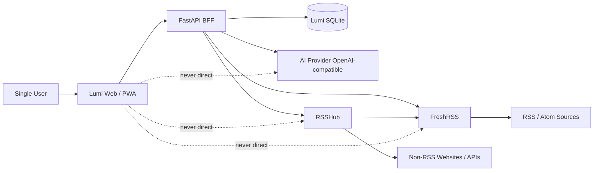
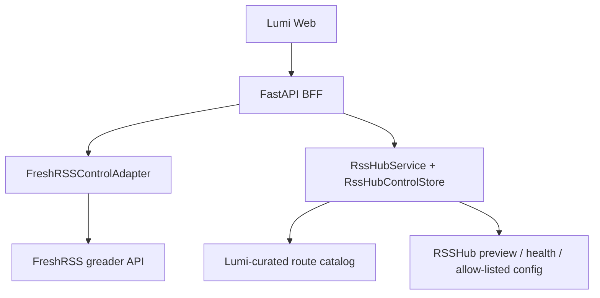

# LumiRSS Architecture

> 本文回答“系统现在如何实现”（HOW）。产品范围与动机见
> [product/PRD.md](../product/PRD.md)；关键决定的历史见
> [decisions/](decisions/) 与 [milestones/](../milestones/)。
> 事实基准：本地源码（`apps/web/`、`services/bff/`）+ CI 于 2026-09 复核。

---

## 1. Architecture principles

1. **Mature engines behind a Lumi-owned boundary.** FreshRSS 和 RSSHub 承担
   它们擅长的职责；Lumi 提供唯一日常产品界面。
2. **FreshRSS owns the RSS domain.** feeds / categories / entries /
   read / starred / subscriptions / OPML 只以 FreshRSS 为真源；Lumi SQLite
   永不影子复制 RSS 数据。
3. **The browser talks only to the Lumi BFF**（`/api/v1/*` 相对路径），
   不直连 FreshRSS、RSSHub 或 AI Provider，不持有上游凭据。
4. **Two-plane split.** 读取数据面（read/data plane）与来源/服务控制面
   （source/service control plane）分离；控制面不改变读取路径。
5. **AI is optional and non-blocking.** AI 未配置或失败不影响阅读、
   状态写入与来源管理；GET 类 AI 端点绝不触发 Provider 调用。
6. **Untrusted content is sanitized as the final boundary.** 文章 HTML 经
   受控 transform 后必须通过 DOMPurify 才能进入 React。
7. **Honest state.** read/star 写入用 set 语义；分页 cursor 与
   `entryRef` 均为 opaque；打开文章不自动标为已读；所有网络状态都有
   loading/empty/error UI。

---

## 2. System context



浏览器只信任 Lumi 契约，不感知上游实现细节。

---

## 3. Data ownership

| 数据 | 权威位置 |
| --- | --- |
| RSS feeds / categories / entries | FreshRSS |
| read / starred 状态、刷新与保留策略 | FreshRSS |
| 订阅 / 分类 / OPML | FreshRSS（经 `FreshRSSControlAdapter` 管理） |
| RSSHub 路由目录（Lumi 精选元数据） | BFF 代码内静态 `CATALOG`（14 条，pinned 实例逐一验证） |
| RSSHub 期望/已应用配置 | Lumi SQLite `lumi_settings`（`rsshub.desired` / `rsshub.applied`） |
| RSSHub 运行时实例地址 | 环境变量 `RSSHUB_BASE_URL` / `RSSHUB_FRESHRSS_BASE_URL` |
| AI 非机密设置与 purpose 映射 | Lumi SQLite（`ai.provider` / `ai.base_url` / `ai.model` / `ai.summary_language` / `ai.translation_language` / `ai.purposes`） |
| AI API keys、WebDAV 密码、RSSHub 机密 | `data/secrets.json`（chmod 600；刻意放在 DB 与备份之外） |
| AI 结果（摘要 / 译文 / 会话） | Lumi SQLite（`ai_summaries` / `ai_translations` / `ai_conversations`(+`_messages`)） |
| 便携应用/阅读设置 | Lumi SQLite 单个 JSON 文档（`app.settings`，`schemaVersion: 1`），浏览器本地优先 + debounce 同步 |
| 设备本地设置（布局宽度、自定义字体、过滤规则、稍后读） | 浏览器 localStorage / IndexedDB，不上传 |
| 备份任务账本 | Lumi SQLite `backup_jobs` |
| schema 版本 | `schema_migrations`（`migrations/0001`–`0004`，事务化 exactly-once） |

硬规则：

> FreshRSS 是 RSS 数据唯一真源。`lumi.sqlite` 不得存 feeds / entries /
> read / starred / subscription / category 的任何影子副本。

---

## 4. Read / data plane

```text
Native RSS / Atom ────────────────┐
                                   ▼
Non-RSS → RSSHub-generated feed → FreshRSS
                                   ▼
                          FreshRSSAdapter
                                   ▼
                            FastAPI BFF
                                   ▼
                              React Web
```

- FreshRSS 抓取并规范化 RSS 域数据；RSSHub 只在上游生成 feed；
- `FreshRSSAdapter`（Google Reader 读路径）：ClientLogin 认证、
  feed / entry 列表（过滤在 FreshRSS 侧执行）、entry 详情
  （HTML → 纯文本）、`edit-tag` 写 read/star（set 语义）；
- BFF 把上游协议映射为稳定 Lumi DTO；Web 只经 BFF 读写；
- RSSHub 宕机时，FreshRSS 已抓取的内容照常可读。

---

## 5. Source / service control plane



规范表述（避免旧文档歧义）：

> 正常文章读取路径绝不绕过 FreshRSS 去“读 RSSHub”。控制面组件仅为了
> 路由目录、预览、健康探测与 allow-listed 实例配置而联系 RSSHub。

### FreshRSSControlAdapter

- subscribe / unsubscribe / 分类移动与重命名 / OPML 导入导出；
- 复用读路径的同一个 `FreshRSSSession`（单次 ClientLogin，无第二套凭据）；
- 不向浏览器暴露原始凭据。

### RSSHub（`RssHubService` + `RssHubControlStore`）

- **控制链固定为 Browser → Lumi BFF → RSSHub**，浏览器不直连；
- 路由目录是 Lumi 自有静态精选 `CATALOG`（14 条，非运行时抓取 RSSHub
  文档），参数经 pattern 校验映射为安全表单；
- 预览：BFF 服务端构造路径并抓取 RSSHub，返回的 `feedUrl` 使用
  `RSSHUB_FRESHRSS_BASE_URL`（FreshRSS 抓取视角）；
- 实例配置为 **schema 驱动的类型化 allow-list**：非机密键存
  `lumi_settings`（desired / applied 两态），机密走 `SecretsStore`
  （write-only）；保存不等于生效——`restartRequired = desired ≠ applied`，
  operator 导出 `rsshub.env` 片段重启 RSSHub 后调
  `POST /api/v1/rsshub/config/apply` 确认；Lumi 不自行重启 RSSHub；
- 旧的浏览器侧“参考实例清单 / 总开关”假控制已退役，并有回归测试钉死；
- 绝不暴露任意 shell / Docker 控制。

---

## 6. Component responsibilities

### Web / PWA

Owns: 导航与选择状态、响应式呈现、Timeline 与 Reader、设置 UI、
订阅/来源工作流、无障碍与键盘交互、文章 HTML 的最终净化边界。

Does not own: FreshRSS/RSSHub/AI 凭据、RSS 抓取调度、权威 read/star
状态、服务端连接器执行。

PWA 形态：可安装 manifest（standalone、图标齐全），无 Service Worker
（无离线缓存）。

### BFF (FastAPI)

Owns: 稳定 Lumi API 契约（typed 请求/响应模型）、输入校验、adapter
编排、上游错误规范化（稳定错误码）、超时策略、机密处理、AI 缓存与
设置、备份/恢复引擎。

Does not own: FreshRSS 条目副本、任意 Docker 管理、前端视觉状态。

### FreshRSS

RSS 域唯一真源（见 §3）。FreshRSS 自身 UI 仅作为高级逃生入口，
不是日常工作流。

### RSSHub

把受支持的非 RSS 来源转换为 RSS/Atom 输出；拥有路由执行与缓存行为。
不拥有订阅状态、read/star、用户偏好或任何用户界面。

### Lumi SQLite

Lumi 自有应用状态：AI 结果缓存与元数据、AI 设置与 profile、purpose
映射、便携应用设置（`app.settings`）、RSSHub 期望/应用配置、备份任务
账本、`schema_migrations`。WAL + busy_timeout + foreign_keys；migrations
为带版本号的 SQL 文件（`BEGIN IMMEDIATE` 事务、失败回滚），不用
Alembic。不是 RSS 影子数据库。

### Caddy / deployment edge

- same-origin 路由：`/api/*` → `bff:8000`，其余 SPA fallback；
- TLS 三态：真实域名 → Let's Encrypt；`localhost` → 自签 + 强制
  HTTPS；`http://:80` 形式 → 纯 HTTP（仅内网调试）；
- 安全响应头（nosniff / X-Frame-Options DENY / no-referrer）；
- 可选 basic auth（单用户远程部署）；FreshRSS / RSSHub 不经 Caddy 暴露，
  仅 `web` 发布 80/443；
- 通用请求体大小 / 速率限制等硬化明确延后（见 §14）。

---

## 7. AI architecture

```text
设置 → AI（浏览器）
  ├── Profiles（label / Base URL / Model / 启停）
  ├── Purpose mapping：summary（摘要）/ translation（翻译）/ chat（AI 对话）
  ├── Default key + 全局 Base URL / Model / 两种语言
  └── keys 经 write-only API 提交 → SecretsStore（服务端，永不可回读）
```

- **Provider 契约**：`AIProvider` protocol，唯一实现
  `OpenAICompatibleProvider`（`chat/completions`，共享 httpx client；
  超时 connect 5s / read 60s；temperature 固定 0.3；无自动重试、
  无 fallback 链、无 streaming）。profile 的本质是“不同
  base_url + model + key 组合”，`provider` 字段固定
  `openai_compatible`——不是多供应商路由。
- **Key 解析 decision tree**（`AiProfileStore.effective_config`，
  以 `services/bff/tests/test_ai_profiles_api.py` 为准）：

  ```text
  purpose → 映射目标
  ├─ 映射到具体 profile 且存在、已启用
  │    ├─ 有自有 secret → 生效（profile 的 base_url/model，
  │    │                  key_source="profile_secret"）
  │    └─ 无自有 secret → key_source="missing" → ai_not_configured
  │         （不回退 default key，也绝不回退 env AI_API_KEY）
  └─ 映射到 default（或映射的 profile 已删除/停用 → 落回 default，
         UI 依据 source 字段如实显示）
       ├─ 浏览器设置的 default key → key_source="default_secret"
       ├─ 否则 env AI_API_KEY     → key_source="env"
       └─ 否则                    → key_source="missing"
  ```

- **SecretsStore**：`data/secrets.json`（0600、原子写、明文 JSON），
  刻意置于 DB 与备份之外——备份天然不含机密；恢复后需重新配置。
- **结果缓存于 Lumi SQLite**：缓存身份 =
  `entryRef + contentHash + provider + model + promptVersion + language`；
  会话按文章内容 hash 聚合。prompt 版本：`summary-v1` /
  `translation-v1` / `chat-v1`，系统提示词内含明确的
  prompt-injection 边界。
- **端点语义**：`GET .../summary` / `GET .../translation` 只读缓存，
  绝不调用 Provider；`POST` 才是显式生成；失败以稳定错误码返回
  （`ai_not_configured` / `ai_auth_error` / `ai_model_error` /
  `ai_rate_limited` / `ai_timeout` / `ai_invalid_response` /
  `ai_upstream_error`），上游响应体不外泄。
- **UI 呈现**：三个 AI 能力都内嵌在 Reader 中——
  `ReaderSummary`（摘要卡片）、`ReaderTranslation`（原文/译文切换，
  译文为纯文本渲染，绝不进 HTML 路径，带缓存徽标）、
  `ArticleConversation`（文章上下文对话）。
- 明确延后：多供应商路由、fallback 链、streaming、agent 编排、
  向量数据库 / 全库语义搜索。

历史：0015 建立单 provider + env key 基础；现行为多 profile +
浏览器配置 + 服务端 SecretsStore + purpose 映射（post-0020 维护引入，
见 [milestones/0015](../milestones/0015-ai-summary-sqlite-foundation.md)
与 git 历史）。

翻译考古（避免未来误判）：0010a 曾引入 microsoft/deepl/dlx 翻译
Provider 的**纯配置**设置页，其页内声明“翻译执行需 BFF 代理、届时
生效”——执行引擎与 BFF 代理从未实现（`git log -S deepl -- services/`
为空），该设置页已于 0017 随统一设置下线。翻译能力自 0016 起即为
AI-only。产品中唯一的“本地”语言处理是展示层的本地简繁转换（OpenCC，
见 §8），它是字形转换，**不是**翻译，不依赖任何 Provider。

---

## 8. Reader / content pipeline

```text
raw RSS HTML
  → inert DOM (DOMParser)
  → controlled transforms   本地简繁转换（OpenCC，仅展示层）· bionic 强调 · Shiki 代码高亮
  → DOMPurify.sanitize      最终安全边界（html profile；禁 style 属性与
                            form/iframe/object/embed/style/template 等标签）
  → ArticleContent          全应用唯一 dangerouslySetInnerHTML 注入点
```

- 无 transform 需求时退化为直接 sanitize；raw HTML 永不未经净化进入
  React（`apps/web/src/lib/article-pipeline.ts`、`sanitize-article-html.ts`）。
- “打开原文”链接经 `safeExternalHttpUrl` 校验（仅绝对 http/https），
  渲染为 `target="_blank" rel="noopener noreferrer"`。
- Reader 定制能力（均已实现）：连续排版滑杆（字号/行距/段距/内容宽度/
  页边距）、内置预设、`.lumitheme` 主题包（schema v1，白名单字段）、
  自定义 CSS（自动加 `.lumi-reader` 前缀，仅作用正文，上限 64,000
  字符）、自定义字体（WOFF2 → IndexedDB 或 URL）、中文排版（首行缩进 /
  标点悬挂（实验） / 本地简繁转换（OpenCC，字形转换，≠ AI 翻译））、
  阅读时长、代码高亮主题白名单、
  滚动标记已读（可选，默认关）。
- 便携设置经 `PORTABLE_KEYS` 同步到 `/api/v1/settings`；服务端严格
  校验（未知键 / 越界 / NaN 一律拒绝），损坏或未来版本文档回退默认。
- 视觉/交互规则见 [design/design-system.md](../design/design-system.md)。

---

## 9. Frontend state architecture

- **TanStack Query** 承载全部 server state（feeds / categories /
  subscriptions / entries infinite / entry / AI 设置与结果 /
  operations status / RSSHub config / backups 等）；mutation 一律
  server-confirmed 后 invalidate，不做 optimistic update。
- **Zustand** 承载轻量 UI 状态：
  - `useAppSettings` —— 客户端设置唯一真源（localStorage 单键
    `lumirss-settings`，normalize/migrate/副作用即时应用）；
  - `useReaderUi` —— section / scope / view / selectedEntryRef /
    mobileSidebarOpen；
  - read-later store（设备本地）；旧 theme store 为兼容薄封装。
- **settings-sync**：便携键 600ms debounce 序列化 PATCH 到
  `/api/v1/settings`，启动 hydration，dirty-key 跨重载持久化，
  pagehide keepalive。
- 布局宽度、折叠态、自定义字体、过滤规则、稍后读列表为设备本地，
  永不上传；secrets 永不出现在客户端。
- 交互约束：打开文章只选中，不标已读；标已读路径 = 手动按钮或可选的
  滚动标记（默认关）；read / starred / read-later 三态独立，均 set 语义。

---

## 10. API families

确切路由以 `services/bff/src/lumirss/main.py` 为准；
Web/BFF 路由对齐由 `services/bff/tests/test_api_contract.py` 钉死。

```text
健康（仅容器内可达；Caddy 只反代 /api/*）
  GET /health/live   GET /health/ready

读取 / 状态
  GET  /api/v1/feeds            GET  /api/v1/entries
  GET  /api/v1/entries/{ref}    PATCH /api/v1/entries/{ref}/state

订阅 / 分类 / OPML / FreshRSS 入口
  GET·POST /api/v1/subscriptions        PATCH·DELETE /api/v1/subscriptions/{ref}
  GET  /api/v1/categories               PATCH /api/v1/categories/{id}
  GET  /api/v1/opml/export             POST /api/v1/opml/import[/preview]
  GET  /api/v1/freshrss-ui

来源发现 / RSSHub
  POST /api/v1/feed-preview             POST /api/v1/source-discovery
  GET  /api/v1/rsshub/routes           POST /api/v1/rsshub/preview
  GET·PATCH /api/v1/rsshub/config       GET  /api/v1/rsshub/config/export
  PUT·DELETE /api/v1/rsshub/config/secrets/{key}
  POST /api/v1/rsshub/config/apply

设置
  GET·PATCH·DELETE /api/v1/settings                 （便携 app.settings 文档）
  GET·PUT /api/v1/settings/ai                       （全局非机密设置）
  PUT·DELETE /api/v1/settings/ai/key                （默认 key，write-only）
  GET·POST /api/v1/settings/ai/profiles             PATCH·DELETE .../profiles/{id}
  PUT·DELETE /api/v1/settings/ai/profiles/{id}/secret
  GET·PUT /api/v1/settings/ai/purposes              （purpose → profile 映射）

AI 功能
  GET·POST /api/v1/entries/{ref}/summary
  GET·POST /api/v1/entries/{ref}/translation
  GET  /api/v1/entries/{ref}/conversation
  POST /api/v1/entries/{ref}/conversation/messages

运维 / 备份 / 恢复 / 版本
  GET  /api/v1/operations/status      GET  /api/v1/version
  GET  /api/v1/backups                POST /api/v1/backups（202 后台 job）
  GET  /api/v1/backups/{job_id}       GET  /api/v1/backups/remote（WebDAV）
  GET·PUT /api/v1/backups/webdav      POST /api/v1/backups/webdav/test
  POST /api/v1/restore/preview        POST /api/v1/restore
```

契约原则：

- `entryRef` 与分页 cursor 均为 opaque；state 写入 set 语义；
- 每个家族都有 typed 请求/响应模型、校验、超时与稳定错误语义；
- AI GET 端点绝不触发 Provider 调用；key 端点 write-only，GET 只返回
  `keyConfigured` 布尔；
- 备份没有本地下载端点（本机文件由 operator 直接访问
  `data/backups/`；远端经 WebDAV）；
- `GET /api/v1/version` 返回 `{version, commit, apiVersion}`，commit 由
  Docker build-arg `LUMIRSS_COMMIT` 注入，用于 Web/BFF 版本偏斜诊断。

未实现、不要提前描述的家族：

```text
/api/v1/integrations/*   （web clipping / Obsidian / 邮件等 Phase-2）
```

---

## 11. Security and trust boundaries

- **内容**：RSS/网站 HTML 视为不可信；transform 只动 text node 与白名单
  属性，DOMPurify 是最终边界；正文内链接协议安全交由 DOMPurify 默认
  规则；“打开原文”仅放行绝对 http/https。
- **凭据**：上游凭据（`FRESHRSS_API_PASSWORD` 等）只存在于服务端 env；
  AI / WebDAV / RSSHub 机密只存 `secrets.json`（0600）；所有机密读写
  接口 write-only，不回显、不入日志、不进 Git、不进备份（manifest
  `secretPolicy` 显式排除）。
- **控制面**：BFF 无 Docker socket；RSSHub 配置为 allow-list +
  restartRequired；恢复需先 preview 再显式输入字面量 `RESTORE`，执行前
  自动创建当前状态安全备份；备份归档有成员数 / 总量 / 单文件上限。
- **网络**：WebDAV 客户端 http 仅允许回环/私网字面量地址、重定向限
  同源；来源发现与预览有 scheme/host 校验、有界 body/超时；OPML 导入
  上限 2 MiB。
- **边界**：Caddy 安全响应头；可选 basic auth（两个 auth 变量要么都设
  要么都不设，只设一个容器拒绝启动）；FreshRSS/RSSHub 仅内网。
- **版本偏斜**：关于页对比 Web 构建与 BFF commit（`/api/v1/version`）。
- 延后硬化（0021 候选）：CSP / HSTS、速率限制、通用请求体限制、BFF
  内部鉴权、DNS-rebinding 硬化。

---

## 12. Deployment topology

### Development

```text
docker compose up -d        # 仅 FreshRSS(127.0.0.1:8080) + RSSHub(127.0.0.1:1200)
uv run uvicorn lumirss.main:app --reload   # services/bff，端口 8000
pnpm dev                    # apps/web
```

镜像按 digest/版本 pin；真实凭据只进 gitignored `.env`。

### Production（`docker-compose.prod.yml`）

```text
Internet / private access
          ▼
   web (Caddy, 80/443)      ← 唯一发布端口的服务
   ├── /            → SPA 静态（/srv，try_files → index.html）
   └── /api/*       → bff:8000
                      ├─ lumi-data 卷（lumi.sqlite + secrets.json + backups）
                      ├─ freshrss-data 卷（只读，供在线备份）
                      ├─ FreshRSS（内网，healthcheck 门控 BFF 启动）
                      ├─ RSSHub（内网，非启动阻塞项）
                      └─ AI Provider（出站 HTTPS）
```

- Caddy 镜像内 entrypoint 按 `LUMIRSS_AUTH_USER` + `LUMIRSS_AUTH_HASH`
  渲染 auth / noauth 配置（都设或都不设；只设一个 → 拒绝启动）；
- 版本溯源：`LUMIRSS_BUILD_COMMIT` → BFF `LUMIRSS_COMMIT` 与 Web
  `VITE_GIT_COMMIT` 两个 build-arg，最终呈现在「关于」页与
  `/api/v1/version`；
- 日志：json-file 轮转（10 MB × 3）；资源限制按服务配置；
- 单用户访问：内置 Caddy basic auth；Tailscale / Cloudflare Access 等
  外层方案可替换，但不要无意叠加多套认证。
- 完整操作手册：[development/operations.md](../development/operations.md)。

---

## 13. Failure isolation and observability

- RSSHub 不可用只影响来源发现/预览，不影响阅读；
- FreshRSS 故障以类型化“依赖不可用”呈现，不是空白页；
- AI 未配置/失败永不阻塞阅读、状态写入与来源管理；
- `/health/ready` 只由核心依赖（lumi.sqlite）决定；FreshRSS/RSSHub
  只报告、永不导致 not ready；
- 备份/恢复单并发、阶段真实上报；无无界后台重试循环；
- 日志脱敏；`/api/v1/operations/status` 提供各依赖真实探测（延迟/
  类型化错误），UI 在「设置 → 账户与服务」展示。

---

## 14. Deferred architecture

以下为明确延后，CURRENT 文档不得描述为已存在：

- Phase-2 统一来源层：web clipping、JSON/API connector、邮件、
  Obsidian connector、unified source registry、统一搜索/索引、
  agent workspace；
- 多用户 / 多租户与公共互联网硬化；
- PWA 离线：manifest 已有，Service Worker / 离线缓存 / Push /
  后台同步未实现；
- AI：streaming、fallback 链、多供应商路由、向量检索；
- Caddy 通用速率限制 / 请求体限制 / CSP·HSTS、BFF 内部鉴权
  （0021 Security & Operations Hardening 候选范围）。

---

## 15. Related ADRs and history

正式 ADR（历史记录，不随实现改写）见
[decisions/](decisions/)。关键决定速览：

| ADR | 决定 | 状态 |
|---|---|---|
| [0001](decisions/0001-freshrss-owns-rss-state.md) | FreshRSS owns RSS-domain truth（Lumi 不复制 RSS 记录） | Accepted |
| [0002](decisions/0002-web-only-talks-to-bff.md) | 前端只与 BFF 通信 | Accepted |
| [0003](decisions/0003-no-rss-shadow-database.md) | 不在 SQLite 建 RSS 影子库 | Accepted |

仅在本文维护的决定摘要（原文散见于历史里程碑）：

- **RSSHub 位于读取路径上游**：保持单一 RSS 域状态模型；控制面另建，
  不让 BFF 绕过 FreshRSS 读文章。
- **Lumi 是唯一日常 UI**：需要独立来源/服务控制面支撑。
- **Folo 交互对齐，而非产品对齐**：研究其 UI 模式；社交/经济/社区
  范围不做。
- **App 主题与 Reader 主题相互独立**。
- **AI 可选且非阻塞**。
- **BFF 不做广泛 Docker 控制**；未来控制操作必须走窄 allow-list 边界。
- **上游代码复用必须可追溯 + 许可证门禁**（pin SHA、记录来源、保留
  notices，见 [upstream/](../upstream/)）。

里程碑级历史（每步如何走到当前架构）：
[milestones/](../milestones/)；正常开发无需预读。
