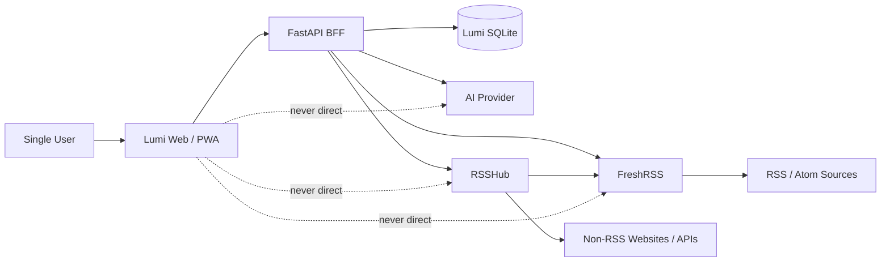
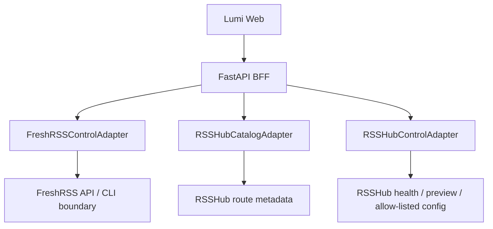
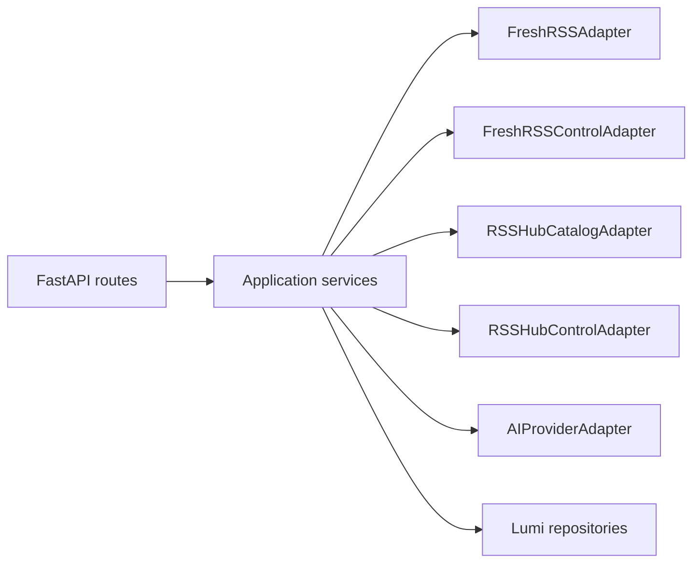
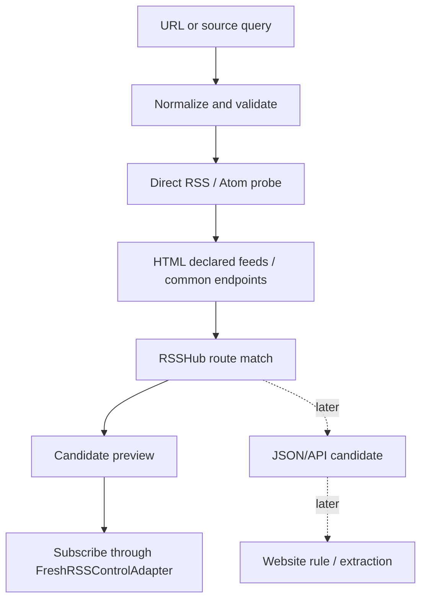
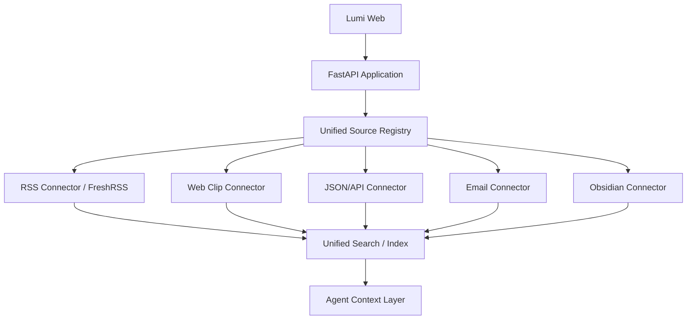

# LumiRSS Architecture v6

> 状态：Adopted v6 baseline（已经 0009 Gate 0 本地仓库事实校准，用户于 2026-08-28 批准）
>
> 目的：在不推翻 0001–0008 的前提下，明确 LumiRSS 当前 RSS 阅读架构、即将增加的控制平面，以及长期多来源知识工作台的扩展边界。

---

## 1. Architecture goals

LumiRSS 的架构要同时满足四件事：

1. 当前是可维护的单用户、自托管 RSS 阅读器；
2. FreshRSS 与 RSSHub 继续承担它们成熟、擅长的职责；
3. 用户日常只操作 LumiRSS，不在多个后台之间来回切换；
4. 未来可以扩展网页剪藏、API、邮件、Obsidian 和 Agent，而不把所有数据硬塞进 FreshRSS。

核心原则：

```text
Use mature engines behind a Lumi-owned product boundary.
```

---

## 2. Current implemented baseline

本地代码已经 0009 Gate 0 核验（2026-08-28）；0020 复核当前实现状态：

- FreshRSS 已作为 RSS 数据引擎；
- RSSHub 已以最小容器方式加入开发 Compose；
- FastAPI BFF 已代理 feeds、entry list、entry detail 和 state writes；
- React Web 已有桌面三栏、移动列表/阅读流程和 PWA Manifest；
- RSSHub 路由已通过 FreshRSS 进入 Lumi 阅读链路；
- **AI 已实现**（0015–0017：文章摘要 / 翻译 / 文章对话 + AI 设置；
  密钥只在服务端 env，结果缓存在 Lumi SQLite，绝不存 FreshRSS 正文）；
- **订阅控制已实现**（0013 FreshRSSControlAdapter：订阅/分类管理 + OPML）；
- **RSSHub 来源发现与控制已实现**（0014：route 发现/预览 + 实例控制）；
- **统一设置中心已实现**（0010/0017）；**备份 / 恢复 / 运维已实现**
  （0018）；**Caddy 生产部署已实现**（0018–0019）；
- 仍未实现（不要描述为已存在）：web clipping、Obsidian 集成、未来多来源
  connector 编排等显式延后的 Phase-2 特性。

最终以本地代码审计结果为准。

---

## 3. System context



The browser trusts Lumi contracts, not upstream implementation details.

---

## 4. Two-plane architecture

A major v6 clarification is the split between the **read/data plane** and the **source/service control plane**.

### 4.1 Read/data plane

```text
Native RSS / Atom ────────────────┐
                                   ▼
Non-RSS → RSSHub-generated feed → FreshRSS
                                   ▼
                          FreshRSSAdapter
                                   ▼
                            FastAPI BFF
                                   ▼
                              React Web
```

Responsibilities:

- FreshRSS fetches and normalizes RSS-domain data;
- FreshRSS owns RSS subscriptions, entries, read state and starred state;
- RSSHub only generates feeds upstream;
- BFF maps FreshRSS protocol/data to Lumi-owned DTOs;
- Web renders and mutates through the BFF only.

The read path must remain usable for already-fetched content when RSSHub is unavailable.

### 4.2 Source/service control plane

0010–0011 起规划，现已落地。Status: **FreshRSSControlAdapter implemented in
0013**（订阅/分类管理 + OPML 导入/导出）；**RSSHub 来源发现 / 预览 / 实例
控制 implemented in 0014**（route 发现 + 预览 + 控制面）。



Responsibilities:

#### FreshRSSControlAdapter

- subscribe / unsubscribe;
- edit title and category;
- OPML import / export;
- selected health and user configuration;
- no exposure of raw credentials to the Web.

Implemented in 0013 (greader protocol via a shared `FreshRSSSession` —
single ClientLogin, no duplicate auth/action-token system; feed title
rename deferred).

#### RSSHubCatalogAdapter

- load and cache route catalog metadata;
- search namespaces/routes;
- map route parameters to safe form schemas;
- indicate routes requiring instance configuration;
- preserve the difference between “route exists” and “instance can currently execute it”.

#### RSSHubControlAdapter

- test instance health;
- preview generated feed;
- expose only approved configuration operations;
- clearly report whether a setting applies immediately or requires service reload;
- never expose arbitrary shell or Docker control.

This plane enables Lumi to become the normal UI without changing the RSS read source of truth.

---

## 5. Component responsibilities

### 5.1 React Web / PWA

Owns:

- navigation and selection state;
- responsive presentation;
- timeline and reader;
- theme and reader appearance UI;
- subscription/source workflows;
- settings UI;
- future AI UI surfaces;
- accessibility and keyboard interactions;
- sanitizing untrusted article HTML at the approved rendering boundary.

  Since 0012 the rendering boundary is a presentation pipeline:
  raw RSS HTML → inert DOM (DOMParser) → controlled presentation
  transforms (OpenCC S↔T conversion, bionic word-initial emphasis, Shiki
  code highlight markers — DOM API only) → **DOMPurify as the final
  trusted boundary** → the single sanctioned
  `dangerouslySetInnerHTML` in `ArticleContent`. Transforms never execute
  scripts, keep event handlers, or reintroduce iframes/styles/`javascript:`
  URLs; raw RSS HTML never reaches React unsanitized. (See
  `apps/web/src/lib/article-pipeline.ts` and spec 0012 §安全模型.)

Does not own:

- FreshRSS credentials;
- direct RSS fetch scheduling;
- RSSHub instance secrets;
- AI provider secrets;
- authoritative RSS read/star state;
- server-side connector execution.

### 5.2 FastAPI BFF

Owns:

- stable Lumi API contracts;
- input validation;
- authentication/session boundary in later deployment milestones;
- adapter orchestration;
- upstream error normalization;
- timeout/retry policy;
- secret handling;
- AI caching/jobs/settings when implemented;
- future unified source registry and connector orchestration.

Does not own:

- a duplicate copy of all FreshRSS entries;
- arbitrary Docker administration;
- frontend-specific visual state;
- raw passthrough of unstable upstream data structures unless explicitly documented.

### 5.3 FreshRSS

Owns the RSS domain:

- subscriptions and feed categories;
- feed refresh state;
- normalized entries;
- unread/read state;
- starred state;
- RSS-domain OPML.

FreshRSS UI becomes an advanced escape hatch, not the normal Lumi workflow.

### 5.4 RSSHub

Owns:

- converting supported non-RSS sources into RSS/Atom output;
- route-specific fetching/parsing;
- route execution and cache behavior.

Does not own:

- subscription state;
- read/star state;
- Lumi user preferences;
- the unified source registry;
- the normal user-facing UI.

### 5.5 Lumi SQLite

Current/planned responsibilities:

- AI result cache — **active (0015)**: `ai_summaries` (entryRef + contentHash + provider/model/promptVersion/language identity; status/summary/failure metadata; never stores FreshRSS article HTML);
- AI job/error metadata — **active (0015)**: status + `failure_type` on the same row;
- Lumi settings — **active (0015, scoped)**: allow-listed non-secret server AI settings (`ai.provider`/`ai.base_url`/`ai.model`/`ai.summary_language`/`ai.translation_language`); secrets stay in server env, never in the DB;
- portable app settings — **active (0017)**: one typed, allow-listed JSON document (`app.settings`, `schemaVersion: 1`) holding cross-device Reader/app preferences (theme, accent, UI font, all continuous Reader typography values, reader background/image/typography prefs, reduced motion, scroll-mark-read); strict pydantic validation (unknown key / wrong type / out-of-range / NaN rejected), corrupted/future documents fall back to defaults; the browser is local-first (immediate Zustand + CSS-variable apply) with a debounced serialized `GET/PATCH/DELETE /api/v1/settings` durability layer — no secrets, no RSS-domain data;
- versioned migrations — **active (0015)**: `schema_migrations` + transactional exactly-once `migrations/*.sql`;
- source discovery drafts and route metadata cache — planned;
- connector configuration references — planned;
- future web clip/API/email/Obsidian records — planned;
- future unified index and processing state — planned.

Explicitly not an MVP shadow RSS database.

### 5.6 Caddy / deployment edge

Production responsibilities（**已实现 0018–0019**；见 `apps/web/Caddyfile.*`、
`apps/web/docker-entrypoint.sh`、`docker-compose.prod.yml`）：

- same-origin routing（Caddy 反代 `/api/*` → `bff:8000`，其余走 SPA）;
- TLS（`DOMAIN` 驱动 Let's Encrypt / 自签本地 / 纯 HTTP 内网三态）;
- security headers（X-Content-Type-Options / X-Frame-Options DENY / Referrer-Policy）;
- access control（可选 basic_auth，单用户远程部署；auth 变量必须成对设置）;
- no public exposure of internal FreshRSS/RSSHub ports（仅 `web` 发布 80/443）.

仍待完善（延后至 0021 安全/运维硬化）：通用请求体大小/速率限制等策略。

---

## 6. Current API surface

已由本地代码核验（0020）。核心读 / 状态写路径（0009 起）：

```text
GET   /health/live             GET   /health/ready
GET   /api/v1/feeds            GET   /api/v1/entries
GET   /api/v1/entries/{ref}    PATCH /api/v1/entries/{ref}/state
```

自 0009 起已实现的 endpoint 家族（确切路由以源码为准）：

```text
订阅 / 分类 / OPML（0013）
  /api/v1/subscriptions[/{ref}]   /api/v1/categories[/{id}]
  /api/v1/opml/export · /import · /import/preview   /api/v1/freshrss-ui
来源发现 / RSSHub（0014 / 0018）
  /api/v1/source-discovery   /api/v1/feed-preview
  /api/v1/rsshub/routes · /preview · /config[/apply|/export|/secrets/{key}]
设置（0015 / 0017）
  /api/v1/settings   /api/v1/settings/ai
AI（0015–0017）
  /api/v1/entries/{ref}/summary · /translation · /conversation[/messages]
备份 / 恢复 / 运维（0018）
  /api/v1/backups[/{id}|/remote|/webdav[/test]]
  /api/v1/restore[/preview]   /api/v1/operations/status
```

契约原则（本地核验）：

- `entryRef` 与 pagination cursor 均为 opaque；
- entry list bodies are not required；detail 可含纯文本与不可信 HTML；
- state writes use set semantics（非 toggle）；
- list filters 映射到上游，而非过滤陈旧的客户端副本；
- 每个家族都有 typed 请求/响应模型、校验、权限/秘密边界、超时与
  稳定错误语义、测试。

### 仍为未来的家族（未实现）

```text
/api/v1/integrations/*   （web clipping / Obsidian / 邮件等显式延后的 Phase-2）
```

---

## 7. Adapter architecture



### FreshRSSAdapter — implemented domain

Expected functions:

- authenticate / recover tokens;
- list feeds;
- list entries with filters and cursor;
- get entry detail;
- set read/star state;
- translate upstream failures into Lumi errors.

### FreshRSSControlAdapter — implemented (0013)

Expected functions:

- subscribe;
- unsubscribe;
- change title/category;
- OPML import/export;
- selected user settings and diagnostics.

Keep it separate from the normal read adapter so elevated/control behavior can be audited independently.

### RSSHubCatalogAdapter — implemented (0014)

Expected functions:

- obtain a pinned/validated catalog representation;
- search route metadata;
- translate parameters into UI-safe schemas;
- identify required configuration;
- cache catalog with version/source metadata.

Do not execute arbitrary code from downloaded metadata.

### RSSHubControlAdapter — implemented (0018)

Expected functions:

- health probe;
- route preview with timeout and output limits;
- safe instance-base selection;
- allow-listed config persistence;
- controlled reload only through a narrow supervisor boundary if later approved.

### AIProviderAdapter — implemented in 0015 (single provider, no SDK)

Actual contract (see `services/bff/src/lumirss/ai_provider.py`):

- narrow `AIProvider.summarize(text, language) -> str` protocol;
- one direct OpenAI-compatible `chat/completions` implementation over the
  shared httpx client (base URL + model from lumi.sqlite, API key from
  server env only);
- bounded timeout (connect 5s / read 60s), no auto-retry of auth /
  invalid-request / model-not-found;
- stable Lumi error mapping (`ai_not_configured` / `ai_auth_error` /
  `ai_model_error` / `ai_rate_limited` / `ai_timeout` /
  `ai_invalid_response` / `ai_upstream_error`), upstream bodies never
  leaked;
- explicit prompt-injection boundary in `summary-v1` system prompt.

Multi-provider routing, fallback chains, streaming and agent orchestration
remain out of scope.

---

## 8. Frontend architecture v6

### 8.1 Layering

```text
App Shell
├── Navigation / Sidebar
├── Timeline
├── Reader
├── Overlay Layer
│   ├── Popover / Menu / Dialog
│   └── future AI floating panel
└── Responsive Layer
    ├── mobile header
    ├── navigation drawer
    ├── list/detail route-state
    └── future bottom sheet
```

### 8.2 State ownership

- TanStack Query: server state, caching, invalidation, loading/error status;
- Zustand: current view/feed/entry and other small UI state;
- local component state: ephemeral controls;
- persistent user preferences — **active (0017)**: ONE Zustand settings store (`useAppSettings`) is the client source of truth; local-first (localStorage cache + immediate CSS-variable application) with a debounced, serialized server durability layer (`/api/v1/settings`) — device-local state (layout widths, custom fonts, presets, filter rules) is never synced; secrets are never present client-side;
- no duplicated feed/entry entity store unless a real offline feature is approved.

Ownership boundaries (0014a roadmap revision, approved 2026-09-02):

- **FreshRSS** = RSS-domain truth: feeds / entries / read / starred /
  subscription / category. Never shadow-copied by Lumi SQLite.
- **lumi.sqlite** (activated in 0015) = Lumi-owned application truth:
  AI result cache, provider/model metadata, prompt version, content hash,
  generation status, persistent Lumi server settings, future backup
  metadata. Migration/schema strategy required before first write
  (no unversioned SQLite file); no RSS-domain shadow data.
- **RSSHub config** = RSSHub runtime/configuration truth. The 0018 RSSHub
  Control Center is a typed schema-driven allow-list (settings with
  secret/restartRequired metadata), not an arbitrary environment-variable
  editor and not arbitrary container administration.

### 8.3 Design-system layers

```text
Semantic tokens
   ▼
UI primitives
   ▼
Domain components
   ▼
Page/layout compositions
```

Page components must not each redefine buttons, menus, selected states or theme colors.

### 8.4 Timeline model

The UI should gracefully support optional visual data:

- feed/source name;
- favicon/icon;
- timestamp;
- title;
- excerpt;
- optional thumbnail;
- read/star state.

If the current API lacks excerpt/image/favicon fields:

- show a clean text-only fallback;
- do not scrape directly from the browser;
- record a future API requirement;
- do not block the UI reboot.

### 8.5 Reader model

The Reader keeps article content primary:

```text
metadata
headline
optional AI summary
article body
```

Reader width, font, size, line height and background are user preferences, but the reader theme is independent from the app theme.

### 8.6 AI overlay model — future

```text
AiChatCore
├── DesktopFloatingPanel
├── DesktopDrawerOrDock
├── MobileBottomSheet
└── FullscreenAiRoute
```

The presentation containers share one chat/session core. This prevents desktop and mobile from drifting into separate products.

---

## 9. Responsive architecture

The current public baseline uses a desktop breakpoint at 1024px. Milestone 0009 should preserve behavior while improving the model.

Recommended target behavior:

| Viewport | Navigation | Timeline | Reader | AI later |
|---|---|---|---|---|
| ≥1440 | fixed sidebar | fixed/resize | fluid | floating panel |
| 1200–1439 | compact sidebar | compact | fluid | overlay/drawer |
| 1024–1199 | collapsible sidebar | visible | visible | drawer |
| 768–1023 | drawer | list/detail | route/detail | sheet/drawer |
| <768 | mobile navigation | single list | separate detail | bottom sheet/fullscreen |

Breakpoints are behavioral guides, not permission for hard-coded device assumptions. Container queries may be considered where useful and supported.

---

## 10. Theme architecture

### 10.1 Theme dimensions

```text
App mode       system / light / dark
Palette        Lumi Mist and future presets
Accent         default indigo or custom color
Reader theme   follow app / paper / warm / sepia / green / custom
Density        comfortable / compact (later)
```

### 10.2 Semantic tokens

Suggested families:

```css
--lumi-canvas
--lumi-sidebar
--lumi-surface
--lumi-surface-elevated
--lumi-reader

--lumi-surface-hover
--lumi-surface-selected
--lumi-surface-pressed

--lumi-text-primary
--lumi-text-secondary
--lumi-text-tertiary
--lumi-text-disabled

--lumi-border
--lumi-separator
--lumi-focus-ring

--lumi-accent
--lumi-accent-hover
--lumi-accent-pressed
--lumi-accent-soft
--lumi-accent-contrast
```

Components use semantic values only. Presets redefine tokens; components do not branch on named themes.

### 10.3 User-custom color

Initial custom-color UI should expose only safe inputs such as accent and reader background. Derived hover/pressed/soft/focus colors should be generated and contrast-checked, not manually entered one by one.

---

## 11. Source discovery architecture — implemented (0014)



MVP source discovery should prioritize stable RSS and RSSHub paths. JSON/API and website parsing belong to Phase 2 unless separately approved.

Security requirements:

- validate schemes and target hosts;
- SSRF protection;
- DNS/rebinding considerations;
- bounded body sizes/timeouts;
- safe redirects;
- no browser-side fetching of arbitrary user URLs;
- preview output sanitized and limited.

---

## 12. Unified settings architecture — implemented (0010/0017)

Lumi should expose product-relevant settings through one UI:

```text
General
Appearance
Reading
Sources
  RSS / FreshRSS
  RSSHub
AI
Data and backup
Advanced diagnostics
```

Rules:

- do not mirror every FreshRSS setting;
- expose only settings that affect Lumi behavior or service health;
- classify settings as immediate, reload-required or restart-required;
- advanced links to upstream UIs may exist as escape hatches;
- secret values are write-only/masked and never echoed back.

---

## 13. Long-term unified source layer

Phase 2 architecture:



The registry should normalize identity, provenance, timestamps, source type and processing state without erasing connector-native data.

Do not implement this whole model during MVP. Preserve extension seams now.

---

## 14. Deployment architecture

### Development

Likely services:

- FreshRSS;
- RSSHub;
- BFF run locally;
- Vite Web dev server;
- local persistent volumes and gitignored secrets.

### Production target

```text
Internet / private access
          ▼
        Caddy
      ┌───┴────┐
      ▼        ▼
  React Web   /api → BFF
                   ├─ FreshRSS internal
                   ├─ RSSHub internal
                   ├─ SQLite volume
                   └─ AI provider outbound
```

Single-user access options must be selected in a production spec, such as a Lumi session, Tailscale, Cloudflare Access or Caddy auth. Do not combine multiple auth schemes accidentally.

---

## 15. Availability and failure isolation

- Reader should display already-fetched FreshRSS content when RSSHub is down;
- AI failures never block reading, state changes or source management;
- a source preview failure does not corrupt existing subscriptions;
- FreshRSS failure is surfaced as dependency unavailability, not generic blank UI;
- cached route metadata may remain usable when remote catalog refresh fails;
- settings/control operations return explicit apply/reload state;
- no unbounded background retry loops.

---

## 16. Observability

Minimum future observability:

- structured, redacted BFF logs;
- request correlation ID;
- liveness and dependency readiness;
- upstream latency/error category without secret URL query values;
- source preview diagnostics safe for user display;
- AI provider/model/timing/usage metadata without prompt/content leakage by default;
- backup/restore audit summaries.

Do not add a heavyweight telemetry platform before the production milestone requires it.

---

## 17. Security model

Threat areas:

- untrusted RSS/HTML;
- SSRF through source discovery and full-text extraction;
- malicious feed URLs/redirects;
- upstream credentials;
- RSSHub route secrets/cookies;
- AI prompt injection in article content;
- arbitrary service control;
- private Obsidian/email data in future;
- logs/screenshots containing private subscriptions.

Core controls:

- server-side validation;
- protocol/host allow-deny policy;
- sanitization;
- strict secret boundaries;
- least-privilege adapters;
- no browser credentials for upstreams;
- no normal BFF Docker socket;
- explicit user action for destructive operations;
- backup encryption/retention decisions in later specs.

---

## 18. Key architecture decisions

### ADR-001 — FreshRSS owns RSS-domain truth

Accepted. Lumi does not duplicate all RSS records in SQLite.

### ADR-002 — RSSHub is upstream of FreshRSS in the read path

Accepted. This preserves one RSS-domain state model.

### ADR-003 — Lumi becomes the sole normal UI

Accepted as product direction. Requires a separate source/service control plane.

### ADR-004 — Frontend talks only to the BFF

Accepted. Prevents credential leakage and upstream coupling.

### ADR-005 — Folo interaction parity, not product parity

Accepted. UI patterns are studied; social/economic/community scope is rejected for MVP.

### ADR-006 — App theme and Reader theme are independent

Accepted. Enables long-form reading preferences without recoloring the full app.

### ADR-007 — AI is optional and non-blocking

Accepted. AI does not gate normal reading or source workflows.

### ADR-008 — Future non-RSS connectors use a Lumi unified layer

Accepted as Phase 2 direction. FreshRSS is not the global data store.

### ADR-009 — No broad Docker control in the BFF

Accepted. Future control operations require a narrow allow-listed boundary.

### ADR-010 — Upstream code reuse requires traceability and license gate

Accepted. Pin SHA, classify reuse and keep notices.

---

## 19. Migration from v5 wording

Documents that currently say “the BFF never talks directly to RSSHub” need a precise replacement:

```text
The normal article read path never bypasses FreshRSS to read RSSHub output.
A separate RSSHub catalog/control adapter (implemented 0014/0018) contacts
RSSHub for route discovery, preview, health and allow-listed instance settings.
```

Documents that say “FreshRSS is the sole source of truth” should become:

```text
FreshRSS is the source of truth for the RSS domain.
Lumi owns application settings, AI metadata and future non-RSS connector data.
```

This is a clarification and extension, not a rewrite of completed 0001–0008 behavior.

---

## 20. Architecture acceptance for milestone 0009

0009 is architectural-safe only when:

- no existing BFF contract is changed without separate approval;
- Web still uses the BFF exclusively;
- read/star semantics and sanitization remain intact;
- responsive behavior remains functional;
- design tokens and component boundaries improve future theming/settings work;
- AI panel is only a presentation boundary unless AI implementation is separately approved;
- source/control features remain documented as planned;
- upstream/license records exist before source-derived code is merged.

