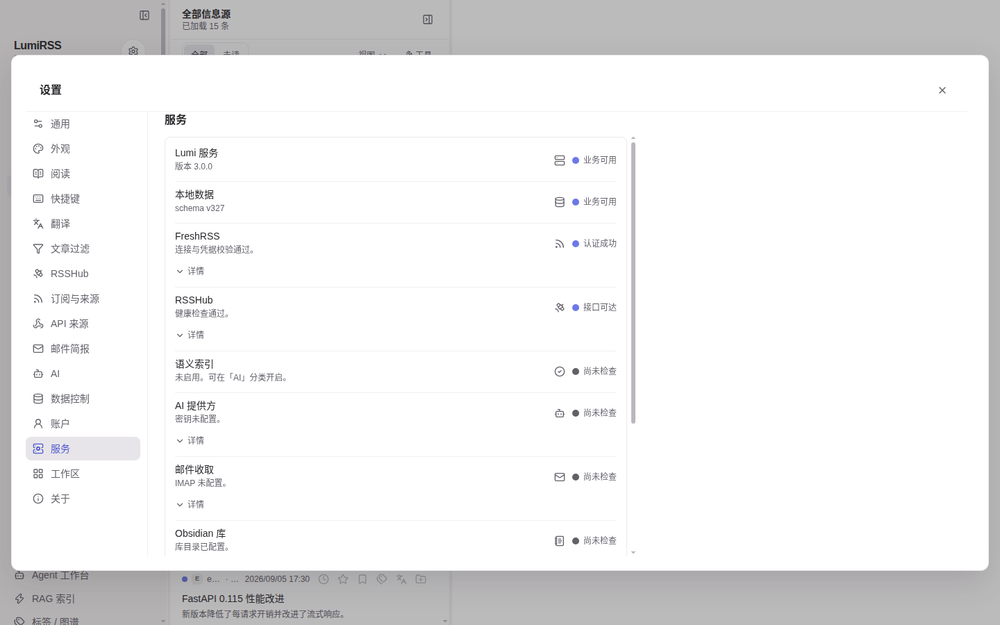

# 管理与运维

本页覆盖管理台（owner/admin）与成员侧的账户/服务治理。机读真源：
[feature-manifest.json](https://github.com/paidethon/LumiRSS/blob/main/docs/feature-manifest.json)（`group: "admin"`）。

`<!-- screenshot-pending: <feature-id> -->` 为截图占位标记，截图阶段按 id
替换。

## 管理台（/admin）

管理台是独立顶层路由（`/admin`），owner/admin 角色专属，权限由服务端
核实——前端隐藏入口只是体验优化，不是边界。

### 管理台入口 {#admin-console}

<!-- screenshot-pending: admin.console -->

运营者控制台：成员、邀请、注册策略、FreshRSS 池、升级与回滚、审计、
工单。入口：浏览器直访 `/admin`。前提：账户角色为 owner 或 admin。

### 邀请管理 {#admin-invites}

<!-- screenshot-pending: admin.invites -->

生成一次性、可过期的邀请链接；可撤销未使用的邀请。入口：/admin → 邀请
管理。结果：受邀人凭邀请在 `/activate` 自选用户名密码激活（见
[邀请成员](../how-to/invite-members)）。

### 邀请方案 {#admin-invite-schemes}

<!-- screenshot-pending: admin.invite-schemes -->

把有效期/次数等参数存为方案模板，按方案批量生成邀请。入口：/admin →
邀请方案。

### 成员管理 {#admin-members}

<!-- screenshot-pending: admin.members -->

改角色、暂停/恢复账户与后台任务、重置密码、撤销全部会话、设置资源配额。
入口：/admin → 成员列表。结果：所有操作走服务端 admin 端点并进审计。

### 公开注册策略 {#admin-registration-policy}

<!-- screenshot-pending: admin.registration-policy -->

实例级开关：是否允许公开注册。入口：/admin → 账户与注册。限制：默认
保持关闭，只有 owner 显式开启才生效（ADR 0006）；LumiRSS 设计上是
邀请制优先的小规模实例。

### FreshRSS 池 {#admin-freshrss-pool}

<!-- screenshot-pending: admin.freshrss-pool -->

FreshRSS 账户池的容量与分配视图。入口：/admin → FreshRSS 池。结果：
池脚本（`scripts/freshrss_pool.sh`）与管理台共享同一份状态。

### 邀请容量 {#admin-capacity}

<!-- screenshot-pending: admin.capacity -->

当前实例还能发多少邀请的容量总览。入口：/admin → 邀请容量。

### 升级预览 {#admin-upgrade-preview}

<!-- screenshot-pending: admin.upgrade-preview -->

升级前预览将发生的变更。入口：/admin → 升级预览。

### 升级进度 {#admin-deploy-status}

<!-- screenshot-pending: admin.deploy-status -->

升级执行的实时状态。入口：/admin → 升级进度。部署操作本身见
[部署 / 升级 / 回滚](../how-to/deploy)。

### 回滚就绪 {#admin-rollback-readiness}

<!-- screenshot-pending: admin.rollback-readiness -->

回滚前置条件是否满足的就绪检查。入口：/admin → 回滚就绪。

### 审计日志 {#admin-audit}

<!-- screenshot-pending: admin.audit -->

管理操作的审计记录。入口：/admin → 审计。

### 运维工单 {#admin-tickets}

<!-- screenshot-pending: admin.tickets -->

成员提交的处理单在管理台的分配/回复/关闭闭环。入口：/admin → 工单
（成员侧在支持入口提交）。

## 账户（成员侧，设置 → 账户）

### 账户资料 {#account-profile}

<!-- screenshot-pending: account.profile -->

展示服务端核实的用户名与角色。入口：设置 → 账户。限制：头像、显示名、
邮箱暂无服务端字段，因此不做假编辑。

### 密码与会话安全 {#account-security}

<!-- screenshot-pending: account.security -->

改密码、Passkey、TOTP 两步验证、登出本机/全部会话。入口：设置 → 账户 →
安全与会话。前提：需要 `LUMIRSS_AUTH_MODE=session`（basic 模式下相关
区块自动隐藏，不展示不可用的开关）。

### 账户数据导出 {#account-export}

<!-- screenshot-pending: account.export -->

导出工作区、标签、书签笔记与日报配置为版本化 JSON（不含密钥）。入口：
设置 → 账户 → 数据导出。

## 服务与诊断（成员侧）

### 服务健康页 {#services-health}

BFF / FreshRSS / RSSHub / AI / 邮件 / Obsidian / RAG 的真实健康：五态
语义（尚未检查 → 进程存活 → 接口可达 → 认证成功 → 业务可用）+ 错误
详情。入口：设置 → 服务。结果：不做假绿灯，每层依赖的失败都能定位。

### 能力可用性 {#capabilities}

<!-- screenshot-pending: capabilities -->

本实例能力状态的统一只读说明，区分「未配置」与「探测失败」，展示探测
本身不产生费用。入口：设置 → 关于 → 能力可用性。

### 关于与构建溯源 {#about-version}

<!-- screenshot-pending: about.version -->

Web 与 BFF 的版本与构建信息，版本错配有诊断提示。入口：设置 → 关于。
